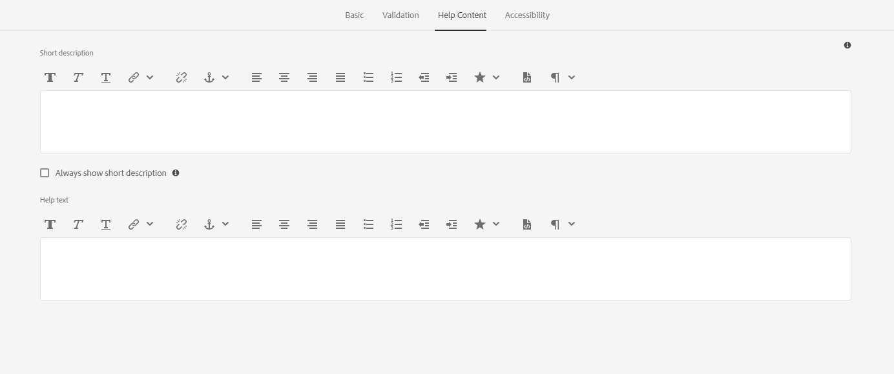
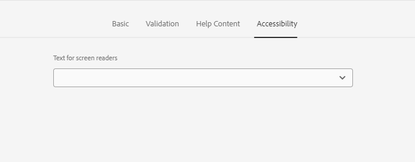

# Campo de opción de imagen del formulario adaptable {#image-choice}

El componente Opción de imagen de un formulario permite a los usuarios realizar selecciones basadas en representaciones visuales, como imágenes, en lugar de en opciones basadas en texto. Presenta una serie de imágenes, cada una de las cuales representa una elección distinta. Los usuarios pueden seleccionar una o varias imágenes, y los comentarios visuales indican su selección. Este componente es útil para opciones como variantes de productos, respuestas de encuestas o imágenes de perfil. Mejora la participación del usuario y la claridad al ofrecer un método de selección intuitivo y visualmente atractivo.

## Uso

Existen varias funciones clave del componente Opción de imagen, como:

- **Representación de imagen:** Los usuarios ven imágenes en lugar de etiquetas de texto tradicionales o botones de opción. Cada imagen corresponde a una opción que pueden seleccionar, lo que proporciona una representación visual de las opciones disponibles.

- **Imágenes en las que se puede hacer clic:** Los usuarios pueden seleccionar una opción haciendo clic directamente en la imagen. La imagen seleccionada se resalta con frecuencia para indicar que se ha elegido.

- **Selecciones únicas o múltiples:** Según el diseño del componente, los usuarios pueden seleccionar una sola imagen o varias imágenes.

## Versión y compatibilidad {#version-and-compatibility}

El componente de opción de imagen de Forms adaptable se publicó como parte de los componentes principales 2.0.64. A continuación se muestra una tabla con todas las versiones admitidas, la compatibilidad con AEM y los vínculos a la documentación correspondiente:

| Versión del componente | AEM as a Cloud Service |
|---|---|
| v1 | Compatible con la  [versión 2.0.64](/help/adaptive-forms/version.md) y posteriores |

Para obtener información sobre las versiones y publicaciones de los componentes principales, consulte el documento [Versiones de los componentes principales](/help/adaptive-forms/version.md).

## Detalles técnicos {#technical-details}

Obtenga la información más reciente sobre el componente principal de opción de imagen de Forms adaptable en la documentación técnica de [GitHub](https://github.com/adobe/aem-core-forms-components/tree/master/ui.af.apps/src/main/content/jcr_root/apps/core/fd/components/form/). Para obtener más información sobre el desarrollo de los componentes principales, consulte la [Documentación para desarrolladores de componentes principales](/help/developing/overview.md).

## Cuadro de diálogo de configuración {#configure-dialog}

Puede personalizar fácilmente la experiencia del componente Opción de imagen para los visitantes con el Cuadro de diálogo de configuración.

### Pestaña Básicos {#basic-tab}

- **Nombre**: puede identificar fácilmente un componente de formulario con su nombre único tanto en el formulario como en el editor de reglas, pero el nombre no debe contener espacios ni caracteres especiales.

- **Título**: con su Título, puede identificar fácilmente un tipo de componente en un formulario adaptable y, de forma predeterminada, el título aparece al lado del componente.

- **Ocultar título**: para ocultar el título, marque la casilla Ocultar título.

- **Opciones**: le ayuda a agregar una o varias imágenes y a personalizar las propiedades de las opciones de imagen. Las propiedades de opción de imagen incluyen Valor de datos, Recurso de referencia de imagen y Texto alternativo para cada una de las imágenes.

- **Referencia de vínculo**: una referencia de vínculo es una referencia a un elemento de datos que se almacena en una fuente de datos externa y se utiliza en un formulario. La referencia de enlace permite enlazar datos de forma dinámica a campos de formulario, de modo que el formulario pueda mostrar los datos más actualizados de la fuente de datos.

  Por ejemplo, se puede utilizar una referencia de enlace para mostrar el nombre y la dirección de un cliente en un formulario, según el ID introducido en el formulario por el cliente. La referencia de enlace también se puede utilizar para actualizar la fuente de datos con los datos del formulario. De este modo, AEM Forms permite crear formularios que interactúen con orígenes de datos externos, lo que proporciona al usuario una experiencia óptima para recopilar y administrar datos.

- **Marcar como elemento de formulario independiente**: seleccione la opción para configurar un campo de formulario no vinculado a ningún esquema. Esta opción le permite guardar datos sin actualizar la fuente de datos. También le permite gestionar los datos de forma personalizada, independientemente de la integración de bases de datos estándar.

- **Tipo de datos del valor enviado**: esta opción especifica el tipo de datos del valor enviado cuando se selecciona cualquier opción. Si el **tipo de datos del valor enviado** está establecido en `Number` y se agregan datos de cadena a **Valor de datos** en la pestaña **Opciones**, la pantalla muestra un mensaje de error `Value type mismatch`.

- **Opciones de visualización**: le ofrece la opción de mostrar el campo de opción de imagen horizontal o verticalmente.

- **Valor predeterminado**: esta opción le permite agregar un valor predeterminado (valor de datos) en un campo de formulario. Si se selecciona **Componente deshabilitado** o **Componente de solo lectura**, el valor predeterminado se muestra en la pantalla. Si el usuario no introduce ningún valor en el campo del formulario, este valor se envía en el momento del envío del formulario.

- **Ocultar componente**: seleccione la opción para ocultar el componente en el formulario. El componente permanece accesible para otros fines, como utilizarlo para los cálculos en el Editor de reglas. Esto resulta útil cuando necesita almacenar información que el usuario no necesita ver o cambiar directamente.

- **Deshabilitar componente**: seleccione la opción para deshabilitar o bloquear el componente. El componente desactivado no está activo ni puede editarlo el usuario final. El usuario puede ver el valor del campo, pero no modificarlo. El componente permanece accesible para otros fines, como utilizarlo para los cálculos en el Editor de reglas.

- **Solo lectura**: esta opción le permite agregar un valor predeterminado (valor de datos) en un campo de formulario. Si se selecciona **Componente deshabilitado** o **Componente de solo lectura**, el valor predeterminado se muestra en la pantalla. Si el usuario no introduce ningún valor en el campo del formulario, este valor se envía en el momento del envío del formulario.

- **Tipo de selección**: esta opción permite a los usuarios seleccionar una o varias selecciones de campos de opción de imagen.

### Pestaña Validación {#validation-tab}

- **Obligatorio**: seleccione esta opción si desea mostrar el componente en un formulario adaptable. Después de seleccionar la opción, debe realizar una selección antes de continuar con el envío de un formulario. No puede seleccionar el componente **Ocultar componente** o **Deshabilitar componente en la ficha** Básico** cuando se selecciona esta opción.

- **Mensaje de error**: esta opción le permite escribir un mensaje que se muestra si la casilla de verificación **Requerido** está marcada y el campo de opción de imagen no está seleccionado.

- **Mensaje de validación de secuencia de comandos**: esta opción le permite introducir un mensaje que se mostrará si la validación de la secuencia de comandos falla.

### Pestaña Contenido de ayuda {#helpcontent-tab}

- **Descripción breve**: una descripción breve es una explicación de texto corta que proporciona información adicional o aclaraciones acerca del propósito de un campo de formulario específico. Ayuda al usuario a comprender qué tipo de datos se deben escribir en el campo y puede proporcionar directrices o ejemplos para garantizar que la información introducida sea válida y cumpla los criterios deseados. De forma predeterminada, las descripciones cortas permanecen ocultas. Habilite la opción **Mostrar siempre una descripción breve** para mostrarla debajo del componente.

- **Mostrar siempre una descripción breve**: habilite esta opción para mostrar la descripción breve debajo del componente.

- **Texto de ayuda**: el texto de ayuda hace referencia a información o directrices adicionales que se proporcionan para ayudar a rellenar correctamente un campo de formulario. Aparece cuando el usuario hace clic en el icono de ayuda (i) situado junto al componente. El texto de ayuda proporciona información más detallada que la etiqueta de un campo de formulario o el texto del marcador de posición, y está diseñado para ayudar al usuario a comprender los requisitos o restricciones del campo. También puede ofrecer sugerencias o ejemplos para que el formulario sea más fácil y preciso.

### Pestaña Accesibilidad {#accessibility-tab}

- **Texto para lectores de pantalla**: el texto para lectores de pantalla se refiere a texto adicional que está diseñado para que lo lean tecnologías de asistencia, como lectores de pantalla, que utilizan personas con deficiencias visuales. Este texto proporciona una descripción del audio del propósito del campo de formulario y puede incluir información sobre el título, la descripción, el nombre y cualquier mensaje relevante (texto personalizado) del campo. El texto del lector de pantalla ayuda a garantizar que el formulario sea accesible para todos los usuarios, incluidos los que tengan deficiencias visuales, y les ofrezca una comprensión completa del campo del formulario y de sus requisitos.
   - **Texto personalizado**: seleccione esta opción para utilizar el texto personalizado para las etiquetas de accesibilidad de ARIA. Al seleccionar esta opción, aparece el cuadro de diálogo Texto personalizado. Puede agregar información relevante en el cuadro de diálogo Texto personalizado.
   - **Título**: seleccione esta opción para utilizar el título para las etiquetas de accesibilidad de ARIA.

## Artículos relacionados {#related-articles}

{{more-like-this}}

## Consulte también {#see-also}

{{see-also}}

