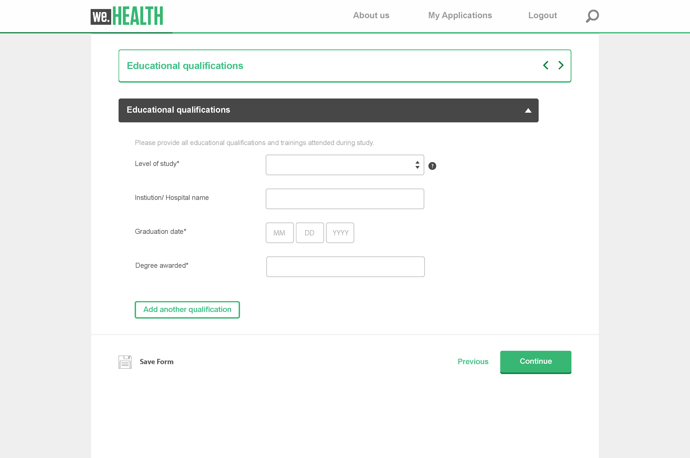

# Componentes principales de formularios adaptables  {#adaptive-forms-core-components-introduction}

Con los componentes principales de formularios adaptables de Adobe Experience Manager, puede crear experiencias de inscripción atractivas.

## Componentes principales {#overview}

En Adobe Experience Manager (AEM), los componentes son los elementos básicos que se utilizan para crear páginas y formularios. Proporcionan una forma sencilla y potente para que los autores creen y gestionen el contenido, a la vez que proporcionan a los desarrolladores la flexibilidad y la capacidad de ampliación necesaria para crear componentes personalizados. Están diseñadas para acelerar el tiempo de desarrollo y reducir los costes de mantenimiento de sitios web y formularios, ser flexibles y se pueden personalizar fácilmente para adaptarse a las necesidades específicas de un sitio web y un formulario.

Los componentes principales también están diseñados para ser adaptables y admiten una amplia gama de dispositivos, incluidos ordenadores de sobremesa, tabletas y teléfonos inteligentes. También cumplen con los últimos estándares web y prácticas recomendadas, convirtiéndolos en una solución firme y fiable para crear contenido web.

En general, los componentes principales son una herramienta esencial para crear y administrar el contenido web en AEM, lo que proporciona una solución potente y flexible que puede ayudar a reducir el tiempo de desarrollo y los costes de mantenimiento, al tiempo que proporciona una buena experiencia de usuario a los visitantes del sitio web.

## Componentes principales de formularios adaptables

Los componentes principales de formularios adaptables son un conjunto de 29 componentes de código abierto compatibles con BEM que se basan en los componentes principales de la gestión de contenidos web de Adobe Experience Manager. Están diseñadas específicamente para utilizarse en la creación de formularios adaptables, que son formularios que se adaptan al dispositivo, navegador y tamaño de pantalla del usuario.

Estos componentes se pueden utilizar para crear experiencias de inscripción y captura de datos excepcionales, proporcionando una amplia gama de opciones de campo de formulario, incluidos campos de texto, casillas de verificación, menús desplegables y mucho más. También incluyen funciones como validación, lógica condicional y diseño interactivo, que pueden utilizarse para crear formularios de fácil manejo y sencillos de usar.

Además, como estos componentes son de código abierto, los desarrolladores pueden personalizar y ampliar fácilmente los componentes para adaptarlos a las necesidades específicas de su organización. Además, estos componentes se basan en la metodología de BEM, que garantiza que sean escalables y mantenibles.

## Características {#features}

|  |  |
|---|---|
| Listo para la producción | Los componentes principales de formularios adaptables son 24 componentes WCM sólidos. |
| Preparado para la nube | Disponible para [AEM Forms as a Cloud Service](https://experienceleague.adobe.com/docs/experience-manager-cloud-service/content/forms/home.html?lang=es). |
| Versátil | Los componentes representan conceptos genéricos con los que los autores de formularios pueden montar casi cualquier diseño. |
| Configurable | Las [políticas de contenido](https://experienceleague.adobe.com/docs/experience-manager-cloud-service/content/implementing/developing/full-stack/components-templates/templates.html?lang=es#content-policies) con respecto a la plantilla definen qué características pueden utilizar o no los autores de la página. |
| Accesible | Proporcionan etiquetas ARIA, admiten la navegación mediante el teclado y texto para tecnologías de asistencia, como lectores de pantalla. |
| Tema capaz | Los componentes implementan el [Sistema de estilos](https://experienceleague.adobe.com/docs/experience-manager-cloud-service/content/sites/authoring/features/style-system.html?lang=es) y el marcado sigue la [nomenclatura de BEM CSS](https://getbem.com/). |
| Personalizable | Varios patrones permiten una fácil personalización, desde ajustar el HTML a una reutilización de funcionalidades avanzadas. |
| Versiones | La [directiva de versiones](https://github.com/adobe/aem-core-wcm-components/wiki/Versioning-policies) garantiza que los componentes principales no romperán el sitio al mejorar las cosas que puedan afectarle. |
| Abrir Con origen en | Si algo no funciona como debería, contribuya a su mejora. |

<!-- comply with [WCAG 2.1 standard](https://www.w3.org/TR/WCAG21/), -->

## Ventajas {#benefits}

Las experiencias de captura de datos son cruciales para la generación de posibles clientes y la inscripción, y los componentes principales de formularios adaptables proporcionan una solución potente para la creación de formularios optimizados para la captura de datos. Algunas de las razones para utilizar los componentes principales para crear estas experiencias sobre los componentes básicos son las siguientes:

* **[Disponibilidad en GitHub](https://github.com/adobe/aem-core-forms-components)**: los componentes principales de formularios adaptables de AEM son de código abierto y están disponibles en GitHub, junto con una documentación exhaustiva. Esto facilita a los desarrolladores la comprensión de los componentes y de cómo funcionan, así como la contribución a su desarrollo. El sitio web [aemcomponents.dev](https://www.aemcomponents.dev/) también es un recurso valioso, donde los desarrolladores pueden ver los componentes en acción y acceder a la documentación detallada.

* **[Modelo BEM para estilos](https://experienceleague.adobe.com/es/docs/experience-manager-cloud-service/content/forms/adaptive-forms-authoring/authoring-adaptive-forms-core-components/create-an-adaptive-form-on-forms-cs/using-themes-in-core-components)**: los componentes principales siguen el modelo de estilo de BEM (Block Element Modifer), que es una metodología establecida y ampliamente utilizada para organizar CSS. Esto facilita a los desarrolladores comprender cómo se organizan los estilos y cómo modificarlos para adaptarlos a sus necesidades específicas.

* **Sin depender de bibliotecas de terceros**: una de las ventajas de los componentes principales es que no dependen de las bibliotecas JavaScript de terceros, incluidas JQuery y Underscore. Esto hace que los componentes sean más rápidos y livianos, así como más fáciles de integrar en una implementación de AEM existente.

* **Centrarse en el rendimiento y la accesibilidad**: los componentes principales se crean teniendo en cuenta el rendimiento y la accesibilidad, lo que se refleja en sus altas puntuaciones de Google Lighthouse y Web Vitals. Esto facilita a los desarrolladores la creación de páginas web accesibles y de alto rendimiento, que es cada vez más importante en el panorama digital actual.

* **Componentes de formulario en plantillas y temas de Sites 30**: los componentes principales son compatibles con los componentes de formulario de la plantilla y los temas de Sites 30, lo que facilita a los desarrolladores la creación y personalización de formularios dentro de AEM.

* **[Mayor facilidad para aplicar estilos](https://experienceleague.adobe.com/es/docs/experience-manager-cloud-service/content/forms/adaptive-forms-authoring/authoring-adaptive-forms-core-components/create-an-adaptive-form-on-forms-cs/using-themes-in-core-components)**: es más fácil aplicar estilos a los componentes principales que sus componentes de base equivalentes. El proceso de creación del tema es similar al de Sites, con la capacidad de heredar el mismo tema/CSS de la página principal de Sites. Además, el modelo BEM para aplicar estilo facilita la comprensión y modificación de los estilos.

* **Accesibilidad**: los componentes principales de formularios adaptables admiten normas y directrices de accesibilidad para garantizar que las personas con discapacidades puedan utilizar los formularios, incluidas aquellas personas que utilizan tecnologías de asistencia como lectores de pantalla

* **[Versiones](https://experienceleague.adobe.com/es/docs/experience-manager-cloud-service/content/forms/adaptive-forms-authoring/authoring-adaptive-forms-core-components/create-an-adaptive-form-on-forms-cs/add-comments-annotations-versioning-adaptive-form-core-components)**: puede crear y administrar varias versiones de formularios adaptables basados en componentes principales, participar en debates de colaboración con comentarios y adjuntar anotaciones a componentes de formulario específicos, lo que mejora la experiencia general de creación de formularios.

## Componentes disponibles: desglose por tipo de componente

La versión actual de AEM Forms tiene los siguientes componentes principales, [Componentes de base](https://experienceleague.adobe.com/es/docs/experience-manager-cloud-service/content/forms/adaptive-forms-authoring/authoring-adaptive-forms-foundation-components/create-an-adaptive-form-on-forms-cs/introduction-forms-authoring#component-toolbar), y [Componentes de bloque de formulario (Edge Delivery Services)](https://experienceleague.adobe.com/es/docs/experience-manager-cloud-service/content/edge-delivery/build-forms/forms-references/form-components).

| Componentes | Componentes de base | Componentes principales | Componentes de bloque de formulario | Información adicional |
|------------|:---------------------:|:---------------:|:---------------------:|-----------------------|
| Bloque de Adobe Sign | ✔️ | | | [La integración de Adobe Sign](https://experienceleague.adobe.com/es/docs/experience-manager-cloud-service/content/forms/integrate/services/adobe-sign-integration-adaptive-forms#adobe-acrobat-sign-for-government) solo está disponible en los componentes de base. |
| Acordeón | ✔️ | [✔️](/help/adaptive-forms/components/accordion.md) | | Para los componentes de base, puede configurar el diseño de acordeón en las [propiedades del componente de panel](https://experienceleague.adobe.com/es/docs/experience-manager-cloud-service/content/forms/adaptive-forms-authoring/authoring-adaptive-forms-foundation-components/configure-layout-of-an-adaptive-form/layout-capabilities-adaptive-forms#panel-layout). |
| Fragmento de formulario adaptable | ✔️ | ✔️ | | Para los componentes de base, puede [añadir un fragmento](https://experienceleague.adobe.com/es/docs/experience-manager-65/content/forms/adaptive-forms-basic-authoring/adaptive-form-fragments#insert-a-fragment-in-an-adaptive-form) desde las propiedades de un explorador de recursos. |
| reCAPTCHA | ✔️ | ✔️ | ✔️ | Para los componentes de base, utilice el componente Captcha para añadir [Google reCaptcha a un formulario](https://experienceleague.adobe.com/es/docs/experience-manager-cloud-service/content/forms/adaptive-forms-authoring/authoring-adaptive-forms-foundation-components/add-components-to-an-adaptive-form/captcha-adaptive-forms#google-reCAPTCHA). |
| Botón | ✔️ | [✔️](/help/adaptive-forms/components/button.md) | ✔️ | |
| Gráfico | ✔️ | | | |
| Casilla de verificación | ✔️ | ✔️ | | |
| Grupo de casillas de verificación | ✔️ | [✔️](/help/adaptive-forms/components/checkbox-group.md) | ✔️ | Para los componentes de base, utilice el componente de casilla de verificación para añadir varias casillas de verificación |
| Campo de introducción de fecha | ✔️ | | | Para los componentes principales, utilice el componente [Selector de fecha](/help/adaptive-forms/components/date-picker.md). También puede añadir componentes independientes [cuadro de texto](/help/adaptive-forms/components/text-box.md) o [cuadro numérico](/help/adaptive-forms/components/numeric-box.md) para capturar el día, el mes y el año. |
| Selector de fecha | ✔️ | [✔️](/help/adaptive-forms/components/date-picker.md) | ✔️ | |
| Lista desplegable | ✔️ | [✔️](/help/adaptive-forms/components/drop-down-list.md) | ✔️ | |
| Correo electrónico | ✔️ | [✔️](/help/adaptive-forms/components/email-input.md) | ✔️ | |
| Archivo adjunto | ✔️ | [✔️](/help/adaptive-forms/components/file-attachment.md) | ✔️ | |
| Lista de archivos adjuntos | ✔️ | | | |
| Pie de página | ✔️ | [✔️](/help/adaptive-forms/components/footer.md) | ✔️ | |
| Marcador de nota al pie | ✔️ | | | |
| Contenedor del formulario | ✔️ | [✔️](/help/adaptive-forms/components/form-container.md) | ✔️ | Para los componentes de base, utilice el [componente Panel raíz](https://experienceleague.adobe.com/es/docs/experience-manager-learn/cloud-service/forms/create-first-af/configure-root-panel). |
| Título del formulario | ✔️ | ✔️ | | Para los componentes de base, utilice el componente de título. |
| hCaptcha | ✔️ | [✔️](/help/adaptive-forms/components/hcaptcha.md) |  | |
| Encabezado | ✔️ | [✔️](/help/adaptive-forms/components/header.md) | ✔️ | |
| Pestañas horizontales | ✔️ | [✔️](/help/adaptive-forms/components/horizontal-tabs.md) | | Para los componentes de base, puede configurar el [diseño de las pestañas en la parte superior (pestañas horizontales)](https://experienceleague.adobe.com/es/docs/experience-manager-cloud-service/content/forms/adaptive-forms-authoring/authoring-adaptive-forms-foundation-components/configure-layout-of-an-adaptive-form/layout-capabilities-adaptive-forms#panel-layout) de las propiedades de los componentes del panel. |
| Imagen | ✔️ | [✔️](/help/adaptive-forms/components/image.md) | ✔️ | |
| Opción de imagen | ✔️ | | | |
| Botón Siguiente | ✔️ | ✔️ | | Utilice el [componente de asistente](/help/adaptive-forms/components/wizard.md) para los botones siguiente y anterior para desplazarse entre varios paneles. |
| Cuadro numérico | ✔️ | [✔️](/help/adaptive-forms/components/numeric-box.md) | ✔️ | |
| Stepper numérico | ✔️ | | | |
| Panel | ✔️ | [✔️](/help/adaptive-forms/components/panel.md) | ✔️ | |
| Cuadro de contraseña | ✔️ | | ✔️ | |
| Teléfono | ✔️ | [✔️](/help/adaptive-forms/components/telephone-input.md) | ✔️ | |
| Botón Anterior | ✔️ | | | Utilice el [componente de asistente](/help/adaptive-forms/components/wizard.md) para los botones siguiente y anterior para desplazarse entre varios paneles. |
| Botón de opción | ✔️ | [✔️](/help/adaptive-forms/components/radio-button.md) | | |
| Grupo de botones de opción | | | ✔️ | |
| Botón Restablecer | ✔️ | [✔️](/help/adaptive-forms/components/reset-button.md) | ✔️ | |
| Firma manuscrita | ✔️ | | | |
| Separador | ✔️ | | | |
| Botón Enviar | ✔️ | [✔️](/help/adaptive-forms/components/submit-button.md) | ✔️ | |
| Paso de resumen | ✔️ | | | |
| Interruptor | ✔️ |  [✔️](/help/adaptive-forms/components/switch.md) | | |
| Tabla | ✔️ | | | |
| Términos y condiciones | ✔️ | ✔️ | | |
| Texto | ✔️ | [✔️](/help/adaptive-forms/components/text.md) | ✔️ | |
| Cuadro de texto | ✔️ | [✔️](/help/adaptive-forms/components/text-box.md) | ✔️ | |
| Título | ✔️ | | | Para los componentes principales, utilice el componente [Título del formulario](/help/adaptive-forms/components/title.md). |
| Torniquete Captcha | ✔️ | | | [Torniquete Captcha](https://experienceleague.adobe.com/en/docs/experience-manager-cloud-service/content/forms/adaptive-forms-authoring/authoring-adaptive-forms-foundation-components/add-components-to-an-adaptive-form/integrate-adaptive-forms-turnstile) solo está disponible para componentes de base. |
| Pestañas verticales | ✔️ | ✔️ | | Para los componentes de base, puede configurar el [diseño de las pestañas a la izquierda (pestañas verticales)](https://experienceleague.adobe.com/es/docs/experience-manager-cloud-service/content/forms/adaptive-forms-authoring/authoring-adaptive-forms-foundation-components/configure-layout-of-an-adaptive-form/layout-capabilities-adaptive-forms#panel-layout) en las propiedades de los componentes del panel |
| Asistente | ✔️ | [✔️](/help/adaptive-forms/components/wizard.md) | ✔️ | Para los componentes de base, puede configurar el [diseño del asistente](https://experienceleague.adobe.com/es/docs/experience-manager-cloud-service/content/forms/adaptive-forms-authoring/authoring-adaptive-forms-foundation-components/configure-layout-of-an-adaptive-form/layout-capabilities-adaptive-forms#panel-layout) en las propiedades de los componentes del panel |

>[!NOTE]
>
>
> * Además de los componentes enumerados anteriormente, el bloque de formularios admite todos los [Tipos de entrada HTML5](https://developer.mozilla.org/es-es/docs/Web/HTML/Element/input#input_types) y [área de texto](https://developer.mozilla.org/es-es/docs/Web/HTML/Element/textarea) como componentes.
> * ¿Necesita un componente no enumerado anteriormente? Solicítelo por correo electrónico a aem-forms-ea@adobe.com desde su dirección oficial.

<!-- >
* [Accordion](/help/adaptive-forms/components/accordion.md)
* [Button](/help/adaptive-forms/components/button.md)
* [Check Box Group](/help/adaptive-forms/components/checkbox-group.md)
* [Date Picker](/help/adaptive-forms/components/date-picker.md)
* [Drop-down list](/help/adaptive-forms/components/drop-down-list.md)
* [Email-input](/help/adaptive-forms/components/email-input.md)
* [Form Container](/help/adaptive-forms/components/form-container.md)
* [File Attachment](/help/adaptive-forms/components/file-attachment.md)
* [Footer](/help/adaptive-forms/components/footer.md)
* [Header](/help/adaptive-forms/components/header.md)
* [Horizontal Tabs](/help/adaptive-forms/components/horizontal-tabs.md)
* [Image](/help/adaptive-forms/components/image.md)
* [Numeric Box](/help/adaptive-forms/components/numeric-box.md)
* [Panel](/help/adaptive-forms/components/panel.md)
* [Radio Button](/help/adaptive-forms/components/radio-button.md)
* [Reset Button](/help/adaptive-forms/components/reset-button.md)
* [Submit Button](/help/adaptive-forms/components/submit-button.md)
* [Telephone input](/help/adaptive-forms/components/telephone-input.md)
* [Text Box](/help/adaptive-forms/components/text-box.md)
* [Text](/help/adaptive-forms/components/text.md)
* [Title](/help/adaptive-forms/components/title.md)
* [Wizard](/help/adaptive-forms/components/wizard.md)

-->

## Editor formularios de fácil uso

El editor de los formularios adaptables basado en componentes principales es similar al que ya utiliza para crear páginas de AEM Sites. Esto es lo que obtiene:

* **Elementos y configuración de IU conocidos**: al configurar propiedades para componentes de formulario, verá que el cuadro de diálogo de propiedades tiene el mismo aspecto que el que utiliza para los componentes principales de WCM. Esto hace que sea más rápido encontrar las opciones que necesita. Al igual que los componentes principales de WCM, para los componentes de formulario, el cuadro de diálogo de propiedades aparece en el centro del editor con pestañas claras que separan las opciones básicas y avanzadas, el texto de ayuda y la información de accesibilidad, todo en un formato de pestañas para facilitar la navegación.

* **[Editor de reglas](https://experienceleague.adobe.com/es/docs/experience-manager-cloud-service/content/forms/adaptive-forms-authoring/authoring-adaptive-forms-core-components/create-an-adaptive-form-on-forms-cs/rule-editor-core-components)**: puede añadir lógica y características dinámicas a los formularios sin tener que escribir código. Puede usar el editor de reglas integrado para:
   * Mostrar u ocultar campos basados en las opciones del usuario
   * Habilitar o deshabilitar un objeto
   * Establecer un valor para un objeto
   * Realizar cálculos
   * Establecer la propiedad de un objeto
   * Validar la entrada de datos
   * Invocar un servicio (llamar a la funcionalidad externa)
   * Usar funciones integradas (funciones predefinidas para tareas comunes)
   * Utilizar funciones personalizadas (su propio código para necesidades específicas)
   * Validar campos y paneles (garantizar que los datos cumplen los requisitos)
   * Validar el valor de un objeto
   * Ejecutar funciones para calcular el valor de un objeto
   * Invocar un servicio del modelo de datos de formulario (FDM) y realizar una operación
   * Añadir estilos de forma dinámica (cambiar el aspecto según las condiciones)
   * Crear otras reglas (acciones en cadena y lógica)
   * y muchos más.

  El editor de reglas no tiene el editor de código. Puede utilizar [funciones personalizadas](https://experienceleague.adobe.com/es/docs/experience-manager-cloud-service/content/forms/adaptive-forms-authoring/authoring-adaptive-forms-core-components/create-an-adaptive-form-on-forms-cs/create-and-use-custom-functions) para añadir su propio código para necesidades específicas al editor de reglas.

* **Rellenado previo de formularios**: puede rellenar automáticamente determinados campos de un formulario con datos existentes cuando un usuario lo abra. Esto ahorra tiempo y esfuerzo a los usuarios al eliminar la necesidad de introducir manualmente información que podría estar disponible. El editor de componentes principales proporciona un servicio de rellenado previo OOTB para rellenar campos de formulario con la ayuda de un modelo de datos de formulario. También puede crear servicios de rellenado previo personalizados para escenarios más complejos.

* **[Documento de registro (DoR)](https://experienceleague.adobe.com/es/docs/experience-manager-cloud-service/content/forms/adaptive-forms-authoring/authoring-adaptive-forms-core-components/create-an-adaptive-form-on-forms-cs/generate-document-of-record-core-components)**: un documento de registro (DoR) hace referencia a una representación formal e imprimible de los datos enviados a través del formulario. Sirve como registro permanente de la información que ha introducido un usuario, y proporciona una instantánea de los datos enviados en un formato fácil de usar, normalmente un documento PDF. Puede utilizar el editor para configurar fácilmente una plantilla personalizada o utilizar una plantilla OOTB para generar un DoR.

* **[Modelo de datos de formulario](https://experienceleague.adobe.com/es/docs/experience-manager-cloud-service/content/forms/integrate/use-form-data-model/using-form-data-model)**: un modelo de datos de formularios adaptables (FDM) actúa como un puente entre sus formularios adaptables y sus fuentes de datos. Básicamente, define la estructura y organización de los datos que los formularios recopilan y con los que interactúan. Puede utilizar el editor para conectar fácilmente el formulario con un modelo de datos de formularios (FDM).

* **[Envíos de formularios](https://experienceleague.adobe.com/es/docs/experience-manager-cloud-service/content/forms/adaptive-forms-authoring/authoring-adaptive-forms-core-components/create-an-adaptive-form-on-forms-cs/configure-submit-actions-core-components#:~:text=Adaptive%20Form%20Submit%20Action&amp;text=Adobe%20recommends%20using%20Core%20Components,to%20create%20standalone%20Adaptive%20Forms.&amp;text=A%20Submit%20Action%20lets%20you,button%20on%20an%20Adaptive%20Form)**: por envío de formularios se entiende el proceso por el que los usuarios completan y envían sus formularios cumplimentados. Esto activa una serie de acciones definidas dentro de la configuración del formulario, que finalmente conducen al almacenamiento o procesamiento de los datos enviados. El editor de formularios adaptables ofrece una variedad de opciones para configurar los envíos de formularios. Algunas de las acciones de envío comunes son:

   * [Enviar correo electrónico](https://experienceleague.adobe.com/es/docs/experience-manager-cloud-service/content/forms/adaptive-forms-authoring/authoring-adaptive-forms-core-components/create-an-adaptive-form-on-forms-cs/configure-submit-actions-core-components#:~:text=Adaptive%20Form%20Submit%20Action&amp;text=Adobe%20recommends%20using%20Core%20Components,to%20create%20standalone%20Adaptive%20Forms.&amp;text=A%20Submit%20Action%20lets%20you,button%20on%20an%20Adaptive%20Form)
   * [Invocar un flujo de Power Automate](https://experienceleague.adobe.com/es/docs/experience-manager-cloud-service/content/forms/integrate/services/forms-microsoft-power-automate-integration)
   * [Enviar a SharePoint](https://experienceleague.adobe.com/es/docs/experience-manager-cloud-service/content/forms/adaptive-forms-authoring/authoring-adaptive-forms-core-components/create-an-adaptive-form-on-forms-cs/configure-submit-action-sharepoint)
   * [Invocar un Workfront Fusion](https://experienceleague.adobe.com/es/docs/experience-manager-cloud-service/content/forms/adaptive-forms-authoring/authoring-adaptive-forms-core-components/create-an-adaptive-form-on-forms-cs/configure-submit-actions-core-components#:~:text=Invoke%20a%20Workfront%20Fusion)
   * [Enviar mediante el modelo de datos de formulario (FDM)](https://experienceleague.adobe.com/es/docs/experience-manager-cloud-service/content/forms/integrate/use-form-data-model/using-form-data-model)
   * [Enviar a Azure Blob Storage](https://experienceleague.adobe.com/es/docs/experience-manager-cloud-service/content/forms/adaptive-forms-authoring/authoring-adaptive-forms-core-components/create-an-adaptive-form-on-forms-cs/configure-submit-actions-core-components#:~:text=Submit%20to%20Azure%20Blob%20Storage)
   * [Enviar al punto final REST](https://experienceleague.adobe.com/es/docs/experience-manager-cloud-service/content/forms/adaptive-forms-authoring/authoring-adaptive-forms-core-components/create-an-adaptive-form-on-forms-cs/configure-submit-action-restpoint)
   * [Enviar a OneDrive](https://experienceleague.adobe.com/es/docs/experience-manager-cloud-service/content/forms/adaptive-forms-authoring/authoring-adaptive-forms-core-components/create-an-adaptive-form-on-forms-cs/configure-submit-actions-core-components#:~:text=to%20REST%20endpoint-,Submit%20to%20OneDrive,-Invoke%20an%20AEM)
   * [Invocar un flujo de trabajo de AEM](https://experienceleague.adobe.com/es/docs/experience-manager-cloud-service/content/forms/adaptive-forms-authoring/authoring-adaptive-forms-core-components/create-an-adaptive-form-on-forms-cs/configure-submit-actions-core-components#:~:text=Invoke%20an%20AEM%20Workflow)

* [Componentes principales de formularios adaptables en el editor de páginas de Sites](https://experienceleague.adobe.com/es/docs/experience-manager-cloud-service/content/forms/adaptive-forms-authoring/create-or-add-an-adaptive-form-to-aem-sites-page): puede habilitar y utilizar los componentes principales de formularios adaptables en el editor de páginas de AEM y Fragmentos de experiencias de AEM para crear directamente una experiencia de captura de datos junto con la creación de una página de Sites.

  >[!VIDEO](https://video.tv.adobe.com/v/3419284?quality=12&learn=on)

<!-- 
* **Preview Forms**: You can use the editor to  simulates how the form would appear on various devices like desktops, tablets, and smartphones.
-->

## Habilitar los componentes principales de los formularios adaptables

Al habilitar los componentes principales de Formularios adaptables en AEM Forms as a Cloud Service, puede empezar a crear, publicar y ofrecer componentes principales basados en Formularios adaptables y Formularios sin encabezado mediante las instancias de Cloud Service de AEM Forms en varios canales. Para obtener instrucciones detalladas sobre la habilitación de los componentes principales de un Formulario adaptable, consulte [Habilitar los componentes principales de Formularios adaptables en AEM Forms as a Cloud Service y en el entorno de desarrollo local](https://experienceleague.adobe.com/docs/experience-manager-cloud-service/content/forms/setup-configure-migrate/enable-adaptive-forms-core-components.html?lang=es).

Los componentes principales de formularios adaptables tienen los siguientes requisitos:

| Versión de AEM | Complementos para AEM Forms | Componentes principales de formularios adaptables |
|---|---|---|
| AEM as a Cloud Service | Forms: inscripción digital | [Versión 2.0.10](version.md)+ |
| AEM 6.5 | Complemento para Formularios | [Versión 1.1.12](version.md)+ |

Si la versión del SDK de AEM Cloud Service es anterior a 2023.02.0, [asegúrese de que tiene el indicador `prerelease` habilitado en su entorno](https://experienceleague.adobe.com/docs/experience-manager-cloud-service/content/release-notes/prerelease.html?lang=es#new-features), ya que los componentes principales de los Formularios adaptables formaban parte de la versión preliminar anterior a la versión 2023.02.0.

## Crear un formulario adaptable basado en componentes principales

Puede realizar las siguientes acciones en los entornos de AEM Forms as a Cloud Service o AEM 6.5 Forms:

| Acción | Versión de AEM Forms |
|--------|------------------|
| Creación un formulario adaptable independiente | [AEM Forms as Cloud Service](https://experienceleague.adobe.com/docs/experience-manager-cloud-service/content/forms/adaptive-forms-authoring/authoring-adaptive-forms-core-components/create-an-adaptive-form-on-forms-cs/creating-adaptive-form-core-components.html?lang=es) |
| Crear un formulario adaptable en una página de AEM Sites | [AEM 6.5 Forms](https://experienceleague.adobe.com/docs/experience-manager-65/forms/adaptive-forms-basic-authoring/create-or-add-an-adaptive-form-to-aem-sites-page.html?lang=es#create-an-adaptive-form-in-sites-editor-or-experience-fragment), [AEM Forms as Cloud Service](https://experienceleague.adobe.com/docs/experience-manager-cloud-service/content/forms/adaptive-forms-authoring/create-or-add-an-adaptive-form-to-aem-sites-page.html?lang=es#create-an-adaptive-form-in-sites-editor-or-experience-fragment) |
| Creación de un formulario adaptable en un fragmento de experiencia de AEM | [AEM 6.5 Forms](https://experienceleague.adobe.com/docs/experience-manager-65/forms/adaptive-forms-basic-authoring/create-or-add-an-adaptive-form-to-aem-sites-page.html?lang=es#create-an-adaptive-form-in-experience-fragment), [AEM Forms as Cloud Service](https://experienceleague.adobe.com/docs/experience-manager-cloud-service/content/forms/adaptive-forms-authoring/create-or-add-an-adaptive-form-to-aem-sites-page.html?lang=es#create-an-adaptive-form-in-experience-fragment) |
| Conversión de un formulario adaptable en un fragmento de experiencia | [AEM 6.5 Forms](https://experienceleague.adobe.com/docs/experience-manager-65/forms/adaptive-forms-basic-authoring/create-or-add-an-adaptive-form-to-aem-sites-page.html?lang=es#convert-an-adaptive-form-in-sites-page-to-an-experience-fragment), [AEM Forms as Cloud Service](https://experienceleague.adobe.com/docs/experience-manager-cloud-service/content/forms/adaptive-forms-authoring/create-or-add-an-adaptive-form-to-aem-sites-page.html?lang=es#convert-an-adaptive-form-in-sites-page-to-an-experience-fragment) |

<!-- >, such as  [WCAG 2.1 standard](https://www.w3.org/TR/WCAG21/), to ensure that forms can be used by people with disabilities, including those using assistive technologies such as screen readers.

*   **Alignment with AEM Sites**: The Core Components are designed to be more aligned with AEM Sites, making it easier for Sites users to adopt and use them without having to learn anything new. The components use the same front-end pipeline as Sites, making it easier to style and modify their appearance. 

<!-- Additionally, the following points further illustrate this alignment:

    *   **Authoring experience inline with Page editor**: The Core Components have an authoring experience that is inline with the Sites editor, with dialogs and other experiences similar to the Page editor. This makes it easier for Sites users to create and manage forms within the familiar context of the Sites editor.

    *   **Inline form editing in Sites editor**: The Core Components allow  inline form editing within the Sites editor, avoiding the need to switch back and forth between editors. This streamlines the authoring experience and makes it easier to create and manage forms.

    *   **Inheriting Sites features in Forms**: Forms authored within a Sites page inherit the same features as Sites. This provides a seamless and integrated experience for creating and managing forms within the context of AEM Sites 
    
    <!--including Multi Site Manager, the ability to use Sites components within a form for static content, support for scheduled publish/unpublish, form translation aligned with Sites translation, versioning, and targeting -->

## Vea también {#see-also}

{{see-also}}
