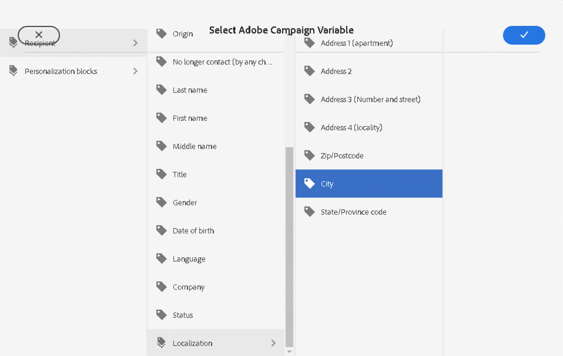
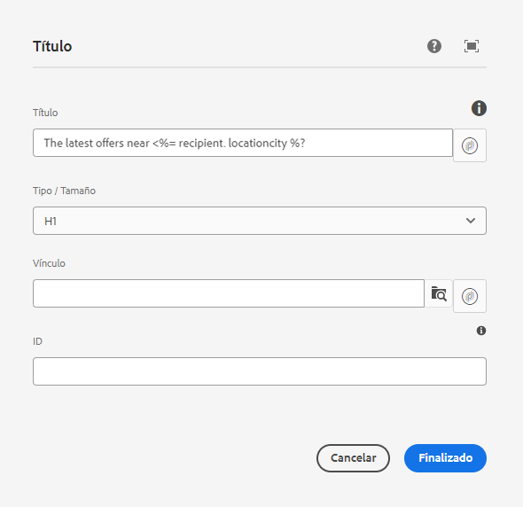

# Variables de campaña {#campaign-variables}

Utilice variables de campaña para componer contenido de correo electrónico personalizado. Las variables de campaña actúan como marcadores de posición para valores de Adobe Campaign que puede insertar en el contenido del correo electrónico. Cuando el contenido se envía mediante Adobe Campaign, Campaign reemplaza esas variables con el contenido personalizado del destinatario.

## Uso {#usage}

Los componentes principales de correo electrónico facilitan el acceso a las variables de campaña mediante botones de personalización junto a campos de texto comunes. Cuando se presiona, aparece un cuadro de diálogo desde el que puede seleccionar un campo de personalización.

La lista de campos personalizados disponibles se sincroniza con la instancia de Adobe Campaign. Los campos se administran en Adobe Campaign en el esquema `nms:seedMember`. Todos los campos de `nms:seedMember` también debe estar presente en la tabla de destinatarios.

## Cuadro de diálogo Seleccionar variable de Adobe Campaign {#dialog}

El cuadro de diálogo Seleccionar variable de Adobe Campaign está disponible en muchos cuadros de diálogo de edición de los componentes principales de correo electrónico. Para usarlo, simplemente haga clic en el botón **Seleccione la variable Adobe Campaign** junto al campo correspondiente. Este icono puede adoptar dos formas.

Al hacer clic en ambos iconos, se abre el **Seleccione la variable Adobe Campaign** diálogo.

Utilice la vista de columna para localizar la variable que desea insertar. Al hacer clic en un nodo de una columna, se muestran sus elementos secundarios en una nueva columna a la derecha. De este modo, puede desplazarse por la estructura de contenido variable.

Seleccione la variable que desee insertar y, a continuación, haga clic en la marca de verificación situada en la parte superior derecha del cuadro de diálogo.

A continuación, la variable se inserta en el campo del cuadro de diálogo de edición del componente principal de correo electrónico.

Haga clic en la X situada en la parte superior izquierda del cuadro de diálogo en cualquier momento para cancelar y cerrar el cuadro de diálogo.
