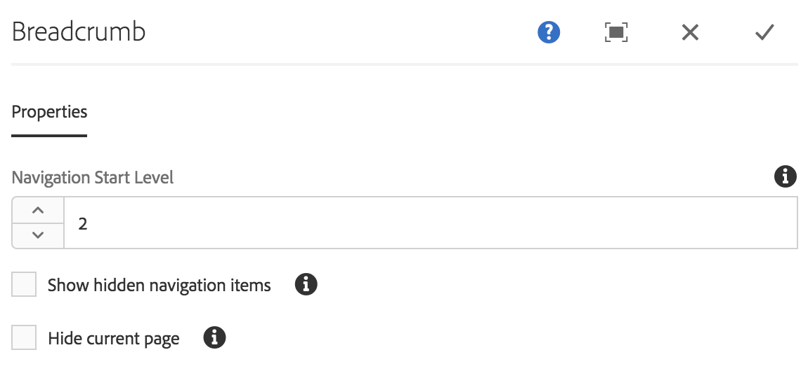
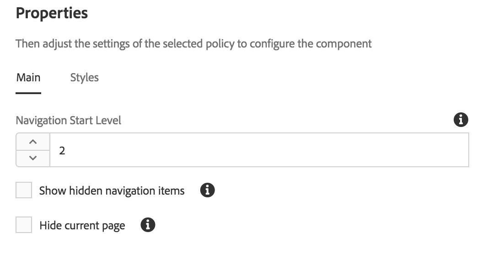

# Componente de sendero de exploración{#breadcrumb-component}

El componente de ruta de componente principal es un componente de navegación que crea una ruta de vínculos basada en la ubicación de la página en la jerarquía de contenido.

## Uso {#usage}

El componente de sendero de exploración muestra la posición de la página actual dentro de la jerarquía del sitio, permitiendo que los visitantes de la página naveguen por la jerarquía de páginas desde su ubicación actual. Esto suele integrarse en encabezados o pies de página de página.

Las opciones disponibles, como el nivel de navegación predeterminado y la capacidad para mostrar la página actual u páginas ocultas, pueden ser definidas por el autor de la plantilla en el cuadro de diálogo [de diseño](#design-dialog). El editor de contenido puede elegir si las páginas ocultas deben mostrarse o no y el nivel de navegación real del componente en el cuadro de diálogo [de edición](#edit-dialog).

## Versión y compatibilidad {#version-and-compatibility}

La versión actual del componente de sendero de exploración es v 2, que se introdujo con la versión 2.0.0 de los componentes principales en enero de 2018 y se describe en este documento.

En la tabla siguiente se detallan todas las versiones compatibles del componente, las versiones AEM con las que son compatibles las versiones del componente y los vínculos a documentación de versiones anteriores.

| Versión del componente | AEM 6.3 | AEM 6.4 | AEM 6.5 |
|--- |--- |--- |--- |
| v2 | Compatible | Compatible | Compatible |
| [v1](breadcrumb-v1.md) | Compatible | Compatible | Compatible |

Para obtener más información sobre versiones y versiones de componentes principales, consulte las [versiones del documento Versiones principales](versions.md).

## Salida de componente de muestra {#sample-component-output}

La siguiente es una muestra tomada de [We. Retail](https://helpx.adobe.com/experience-manager/6-5/sites/developing/using/we-retail.html).

### Captura de pantalla {#screenshot}


### HTML {#html}

```
<nav class="cmp-breadcrumb">
    <ol class="cmp-breadcrumb__list">
        <li class="cmp-breadcrumb__item">
            <a href="/content/we-retail/us.html" class="cmp-breadcrumb__item-link">
                United States
            </a>
        </li>
    
        <li class="cmp-breadcrumb__item">
            <a href="/content/we-retail/us/en.html" class="cmp-breadcrumb__item-link">
                English
            </a>
        </li>
    
        <li class="cmp-breadcrumb__item cmp-breadcrumb__item--active">
            
                Experience
            
        </li>
    </ol>
</nav>
```

### JSON {#json}

```
"breadcrumb":{  
                     "columnClassNames":"aem-GridColumn aem-GridColumn--default--12",
                     "items":[  
                        {  
                           "page":{  
                              "path":"/content/we-retail/us",
                              "pageTitle":null,
                              "name":"us",
                              "description":null,
                              "title":"United States"
                           },
                           "active":false
                        },
                        {  
                           "page":{  
                              "path":"/content/we-retail/us/en",
                              "pageTitle":null,
                              "name":"en",
                              "description":null,
                              "title":"English"
                           },
                           "active":false
                        },
                        {  
                           "page":{  
                              "path":"/content/we-retail/us/en/experience",
                              "pageTitle":null,
                              "name":"experience",
                              "description":null,
                              "title":"Experience"
                           },
                           "active":true
                        }
                     ],
                     ":type":"weretail/components/content/breadcrumb"
                  }
```

>[!NOTE]
>
>Desde la versión de componentes principales 2.1.0, el componente de sendero de exploración admite [schema.org microdata](https://schema.org/BreadcrumbList).

### Detalles técnicos {#technical-details}

La documentación técnica más reciente sobre el componente de sendero de exploración [se encuentra en github](https://github.com/adobe/aem-core-wcm-components/blob/master/content/src/content/jcr_root/apps/core/wcm/components/breadcrumb/v2/breadcrumb).

Encontrará más información sobre el desarrollo de componentes principales en la documentación del desarrollador de componentes [principales](developing.md).

## Editar cuadro de diálogo {#edit-dialog}

El cuadro de diálogo de edición permite que el autor del contenido suprima las páginas ocultas y activas en las rutas, así como la profundidad en la jerarquía que debería mostrar.



* **Nivel** de inicio de navegación: en la jerarquía, el componente de sendero de navegación debería comenzar a desplazarse hacia la página actual. Por ejemplo, en We. Retail:

   * 0 comienza en `/content`

   * 1 comienza en `/content/we-retail`
   * 2 comienza en `/content/we-retail/<country>`

* **Mostrar elementos** de navegación ocultos: Mostrar páginas marcadas como ocultas en la ruta (de forma predeterminada, no se mostrarán)
* **Ocultar la página actual**: Eliminar la página actual en la ruta (de forma predeterminada se mostrará)

## Cuadro de diálogo de diseño {#design-dialog}

El cuadro de diálogo de diseño permite que el autor de la plantilla defina los valores predeterminados para las opciones para eliminar las páginas ocultas y activas en las rutas, así como la profundidad en la jerarquía que debería mostrar.

### Ficha Principal {#main-tab}



* **Nivel** de inicio de navegación: define el valor predeterminado para donde en la jerarquía el componente de sendero de exploración debería comenzar a bajar a la página actual cuando se agrega el componente de sendero de migas a una página.
* **Mostrar elementos** de navegación ocultos: define el valor predeterminado de la opción **Mostrar elementos** de navegación ocultos cuando se agrega el componente de ruta de navegación a una página.

   * No activa ni desactiva la opción para el autor. Solo establece el valor predeterminado.

* **Ocultar página actual**: define el valor predeterminado de la opción **Ocultar página** actual cuando se agrega el componente de sendero de migas a una página.

   * No activa ni desactiva la opción para el autor. Solo establece el valor predeterminado.

### Ficha Estilos {#styles-tab}

El componente de sendero de exploración admite el sistema [de estilos AEM](authoring.md#component-styling).