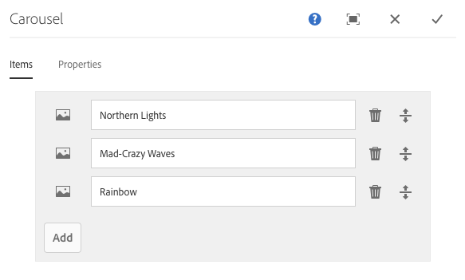

# Carousel Component{#carousel-component}

El componente Carrusel de componente principal permite al autor del contenido presentar contenido en un carrusel navegable.

## Uso {#usage}

Con el componente Carrusel, el autor de contenido organiza el contenido en un carrusel rotatorio de diapositivas.

The [edit dialog](#edit-dialog) allows the content author to create, name, and order multiple slides as well as enable auto-transition with delay. Using the [design dialog](#design-dialog), the template author can define which components can be added to the carousel, enable or disable automatic transitions, and customize the styles.

## Version and Compatibility {#version-and-compatibility}

La versión actual del componente Carrusel es v 1, introducida con la versión 2.2.0 de los componentes principales en octubre de 2018, y se describe en este documento.

En la tabla siguiente se detallan todas las versiones compatibles del componente, las versiones AEM con las que son compatibles las versiones del componente y los vínculos a documentación de versiones anteriores.

| Versión del componente | AEM 6.3 | AEM 6.4 | AEM 6.5 |
|--- |--- |--- |--- |
| v1 | Compatible | Compatible | Compatible |

For more information about Core Component versions and releases, see the document [Core Components Versions](versions.md).

## Sample Component Output {#sample-component-output}

To experience the Carousel Component as well as see examples of its configuration options as well as HTML and JSON output, visit the [Component Library](http://opensource.adobe.com/aem-core-wcm-components/library/carousel.html).

### Technical Details {#technical-details}

The latest technical documentation about the Carousel Component [can be found on GitHub](https://github.com/adobe/aem-core-wcm-components/blob/master/content/src/content/jcr_root/apps/core/wcm/components/carousel/v1/carousel).

Further details about developing Core Components can be found in the [Core Components developer documentation](developing.md).

## Edit Dialog {#edit-dialog}

El cuadro de diálogo de edición permite al autor del contenido agregar, renombrar y reorganizar diapositivas, así como definir la configuración de transición automática.

### Items Tab {#items-tab}

Use the **Add** button to open the component selector to choose which component to add as a tab. Una vez agregado, se agrega una entrada a la lista, que contiene las columnas siguientes:

* **Icono** : el icono del tipo de componente de la ficha para facilitar la identificación en la lista. Pase el ratón para ver el nombre completo del componente como información de objeto.
* **Descripción** : La descripción utilizada como texto de la ficha, predeterminada al nombre del componente seleccionado para la ficha.
* **Eliminar** : toque o haga clic para eliminar la ficha del componente fichas.
* **Reordenar** : toque o haga clic y arrastre para ordenar las fichas.

### Properties Tab {#properties-tab}

On the **Properties** tab, the content author can set the slides to automatically transition.

* **Transición automática de diapositivas** : cuando se activa, el componente pasará automáticamente a la siguiente diapositiva después de un retraso especificado.
* **Retraso** de transición: cuando se selecciona automáticamente diapositivas de transición, este valor se utiliza para definir el retraso entre transiciones (en milisegundos).
* **Deshabilitar pausa automática al pasar el ratón** por encima: cuando **se seleccionan diapositivas** de transición automáticamente, la transición de carrusel se pausa automáticamente siempre que el cursor se sitúa sobre el carrusel. Seleccione esta opción para que la transición no se pause.

>[!NOTE]
>
>The slide advance controls are not enabled when in **Edit** mode. Use [**Preview** mode](https://helpx.adobe.com/experience-manager/6-5/sites/authoring/using/editing-content.html) or the **[View as Published](https://helpx.adobe.com/experience-manager/6-5/sites/authoring/using/editing-content.html)** option to interact with the carousel as a reader of the published content would.
>
>The auto-advance feature is not enabled when in **Edit** mode. Use **[View as Published](https://helpx.adobe.com/experience-manager/6-5/sites/authoring/using/editing-content.html)** option to see the auto-advance feature as a reader of the published content would.

## Select Panel {#select-panel}

The content author can use the **Select Panel** option on the component toolbar to change to a different slide for editing as well as to easily rearrange the order of the slides.

Once selecting the **Select Panel** option in the component toolbar, the configured slides are displayed as a drop-down.

* La lista se ordena por la disposición asignada de las diapositivas y se refleja en la numeración.
* El tipo de componente de la diapositiva se muestra primero, seguido de la descripción de la diapositiva en la fuente más clara.

* Al tocar o hacer clic en una entrada del menú desplegable, cambia la vista del editor a esa diapositiva.
* La diapositiva se puede reordenar en contexto utilizando los controles de arrastrar.

## Design Dialog {#design-dialog}

El cuadro de diálogo de diseño permite al autor de la plantilla definir qué componentes pueden agregarse como diapositivas al componente carrusel, así como definir valores predeterminados de transición automática y qué estilos personalizados están disponibles para el autor del contenido.

### Properties Tab {#properties-tab-1}

The **Properties** tab is used to define the default settings for the slide transitions when a content author adds the carousel component to a page.

* **Transición de transición automática** : Define si de forma predeterminada la opción de avanzar automáticamente el carrusel a la siguiente diapositiva está activada cuando el autor del contenido agrega el componente carrusel a una página.
* **Retraso** de transición: define el valor predeterminado del retraso de transición entre las diapositivas (en milisegundos) cuando un autor de contenido agrega el componente carrusel a una página.
* **Deshabilitar pausa automática al pasar el ratón** : Define si de forma predeterminada la opción para desactivar la pausa automática de la diapositiva está habilitada cuando **el autor de contenido selecciona automáticamente diapositivas** de transición.

### Allowed Components Tab {#allowed-components-tab}

The **Allowed Components** tab is used to define which components can be added as slides to the Carousel Component by the content author.

The Allowed Components tab functions in the same way as the tab of the same name when [defining the policy and properties of a Layout Container in the Template Editor.](https://helpx.adobe.com/experience-manager/6-5/sites/authoring/using/templates.html)

### Styles Tab {#styles-tab}

The Carousel Component supports the AEM [Style System](authoring.md#component-styling).