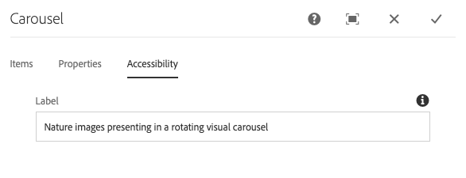

# Componente de carrusel{#carousel-component}

El componente de carrusel de componentes principales permite al autor del contenido presentar el contenido en un carrusel navegable.

## Uso {#usage}

Con el componente Carrusel, el autor del contenido organiza el contenido en un carrusel rotatorio de diapositivas.

El cuadro de diálogo [de](#edit-dialog) edición permite al autor crear, nombrar y ordenar varias diapositivas, así como activar la transición automática con retraso. Mediante el cuadro de diálogo [de](#design-dialog)diseño, el autor de la plantilla puede definir qué componentes se pueden agregar al carrusel, activar o desactivar las transiciones automáticas y personalizar los estilos.

## Versión y compatibilidad {#version-and-compatibility}

La versión actual del componente Carrusel es v1, que se introdujo con la versión 2.2.0 de los componentes principales en octubre de 2018 y se describe en este documento.

En la tabla siguiente se detallan todas las versiones compatibles del componente, las versiones de AEM con las que las versiones del componente son compatibles y los vínculos a la documentación de versiones anteriores.

| Versión del componente | AEM 6.3 | AEM 6.4 | AEM 6.5 | AEM como servicio de nube |
|--- |--- |--- |--- |---|
| v1 | Compatible | Compatible | Compatible | Compatible |

Para obtener más información sobre las versiones y versiones de los componentes principales, consulte el documento Versiones [de componentes](versions.md)principales.

## Ejemplo de salida de componente {#sample-component-output}

Para experimentar el componente Carrusel y ver ejemplos de sus opciones de configuración, así como los resultados HTML y JSON, visite la biblioteca [de](https://adobe.com/go/aem_cmp_library_carousel)componentes.

### Detalles técnicos {#technical-details}

La documentación técnica más reciente sobre el componente Carrusel [puede encontrarse en GitHub](https://adobe.com/go/aem_cmp_tech_carousel_v1).

Encontrará más detalles sobre el desarrollo de los componentes principales en la documentación [para desarrolladores de los componentes](developing.md)principales.

## Edit Dialog {#edit-dialog}

El cuadro de diálogo de edición permite al autor del contenido agregar, cambiar el nombre y reorganizar diapositivas, así como definir la configuración de transición automática.

### Ficha Elementos {#items-tab}

Utilice el botón **Agregar** para abrir el selector de componentes y elegir qué componente agregar como ficha. Una vez agregada, se agrega una entrada a la lista, que contiene las siguientes columnas:

* **Icono** : icono del tipo de componente de la ficha para facilitar la identificación en la lista. Pase el ratón por encima para ver el nombre completo del componente como información sobre herramientas.
* **Descripción** : la descripción utilizada como texto de la ficha, de forma predeterminada según el nombre del componente seleccionado para la ficha.
* **Eliminar** : toque o haga clic para eliminar la ficha del componente de fichas.
* **Reordenar** : toque o haga clic y arrastre para ordenar las fichas.

>[!TIP]
>
>Si se reduce la ventanilla de la página para que el cuadro de diálogo de edición se muestre a pantalla completa, se ocultará el botón **Agregar** . Los componentes se pueden añadir al componente Carrusel [arrastrándolos desde el navegador de componentes y colocándolos en el componente Carrusel en el editor](https://docs.adobe.com/content/help/en/experience-manager-cloud-service/sites/authoring/fundamentals/editing-content.html#inserting-a-component-from-the-components-browser)de páginas.

### Ficha Propiedades {#properties-tab}

En la ficha **Propiedades** , el autor del contenido puede definir las diapositivas para que se realicen transiciones automáticas.

* **Diapositivas** de transición automática: cuando se activa, el componente avanza automáticamente a la siguiente diapositiva tras un retraso especificado.
* **Retraso** de transición: cuando se selecciona Automáticamente diapositivas de transición, este valor se utiliza para definir el retraso entre transiciones (en milisegundos).
* **Deshabilitar la pausa automática al pasar** el ratón por encima: cuando se selecciona Diapositivas **de transición** automática, la transición de carrusel se pausa automáticamente cada vez que el cursor se sitúa sobre el carrusel. Seleccione esta opción para que la transición no se detenga.

>[!NOTE]
>
>Los controles de avance de diapositivas no están activados en el modo de **edición** . Utilice el modo [**de **vista previa](https://docs.adobe.com/content/help/en/experience-manager-cloud-service/sites/authoring/fundamentals/editing-content.html#preview-mode)o la opción **[Ver como publicado](https://docs.adobe.com/content/help/en/experience-manager-cloud-service/sites/authoring/fundamentals/editing-content.html#view-as-published)**para interactuar con el carrusel como un lector del contenido publicado.
>
>La función de avance automático no está habilitada en el modo **Editar** . Utilice la opción **[Ver como publicado](https://docs.adobe.com/content/help/en/experience-manager-cloud-service/sites/authoring/fundamentals/editing-content.html#view-as-published)**para ver la función de avance automático como un lector del contenido publicado.

### Ficha Accesibilidad {#accessibility-tab}

En la ficha **Accesibilidad** , se pueden definir valores para las etiquetas de accesibilidad [de](https://www.w3.org/WAI/standards-guidelines/aria/) ARIA para el componente.

* **Etiqueta** : valor de un atributo de etiqueta ARIA para el componente

## Select Panel {#select-panel}

El autor del contenido puede utilizar la opción **Seleccionar panel** de la barra de herramientas del componente para cambiar a una diapositiva diferente para editarla, así como para reorganizar fácilmente el orden de las diapositivas.

Una vez seleccionada la opción **Seleccionar panel** en la barra de herramientas de componentes, las diapositivas configuradas se muestran como una lista desplegable.

* La lista se ordena según la disposición asignada de las diapositivas y se refleja en la numeración.
* El tipo de componente de la diapositiva se muestra primero, seguido de la descripción de la diapositiva en una fuente más clara.

* Al tocar o hacer clic en una entrada de la lista desplegable, se cambia la vista del editor a esa diapositiva.
* La diapositiva se puede reordenar en su lugar mediante los controladores de arrastre.

## Cuadro de diálogo Diseño {#design-dialog}

El cuadro de diálogo de diseño permite al autor de la plantilla definir qué componentes se pueden añadir como diapositivas al componente de carrusel, así como definir los valores predeterminados de transición automática y qué estilos personalizados están disponibles para el autor del contenido.

### Ficha Propiedades {#properties-tab-1}

La ficha **Propiedades** se utiliza para definir la configuración predeterminada de las transiciones de diapositivas cuando un autor de contenido agrega el componente carrusel a una página.

* **Diapositivas** de transición automática: define si, de forma predeterminada, la opción para avanzar automáticamente el carrusel a la siguiente diapositiva está activada cuando el autor del contenido agrega el componente de carrusel a una página.
* **Retraso** de transición: define el valor predeterminado del retraso de transición entre diapositivas (en milisegundos) cuando un autor de contenido agrega el componente de carrusel a una página.
* **Deshabilitar la pausa automática al pasar** el ratón por encima: Define si la opción predeterminada para desactivar la pausa automática de diapositivas está activada cuando el autor del contenido selecciona **Automáticamente diapositivas** de transición.

### Ficha Componentes permitidos {#allowed-components-tab}

La ficha Componentes **** permitidos se utiliza para definir qué componentes puede agregar el autor del contenido como diapositivas al componente de carrusel.

La ficha Componentes permitidos funciona del mismo modo que la ficha del mismo nombre al [definir la política y las propiedades de un contenedor de diseño en el Editor de plantillas.](https://docs.adobe.com/content/help/en/experience-manager-cloud-service/sites/authoring/features/templates.html)

### Ficha Estilos {#styles-tab}

El componente Carrusel es compatible con el sistema [de](authoring.md#component-styling)estilo AEM.
