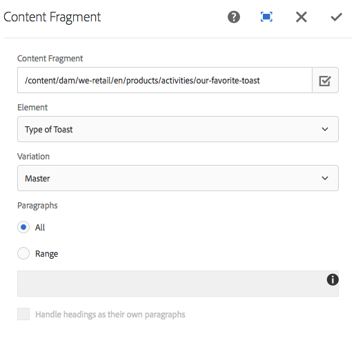

# Componente de fragmento de contenido{#content-fragment-component}

El componente Fragmento de contenido del componente principal permite la visualización de un fragmento [de](https://helpx.adobe.com/experience-manager/6-5/assets/using/content-fragments.html)contenido.

>[!NOTE]
>
>Antes de la versión 2.4.0 de los componentes principales, el componente Fragmento de contenido estaba disponible como extensión para los componentes principales y debía descargarse por separado y habilitarse explícitamente.

## Uso {#usage}

El componente de fragmento de contenido del componente principal permite la inclusión de un fragmento [de](https://helpx.adobe.com/experience-manager/6-5/assets/using/content-fragments.html) contenido en una página.

* El fragmento y sus propiedades se pueden seleccionar en el cuadro de diálogo Configurar.
* Los tipos de recursos para gestionar determinadas imágenes y cuadrículas se pueden definir en el cuadro de diálogo [de](#design-dialog)diseño.
* La opción de edición abrirá el fragmento seleccionado en el editor [de fragmentos de](https://helpx.adobe.com/content/help/en/experience-manager/6-5/assets/using/content-fragments.html)contenido.

## Versión y compatibilidad {#version-and-compatibility}

La versión actual del componente Fragmento de contenido es v1, que se introdujo con la versión 1.1.0 de los componentes principales en octubre de 2017 y se describe en este documento.

En la tabla siguiente se detallan todas las versiones compatibles del componente, las versiones de AEM con las que las versiones del componente son compatibles y los vínculos a la documentación de versiones anteriores.

| Versión del componente | AEM 6.3 | AEM 6.4 | AEM 6.5 |
|--- |--- |--- |---|
| v1 | Compatible | Compatible | Compatible |

>[!NOTE]
>
>Antes de la versión 2.4.0, el componente Fragmento de contenido se encontraba en la carpeta de extensiones.
>
> `apps/core/wcm/extension/components/contentfragment/v1/contentfragment`
> 
>Desde 2.4.0 se ha trasladado a la siguiente ubicación.
>
>`apps/core/wcm/components/contentfragment/v1/contentfragment`
>
>Aunque ambos son v1, cualquier componente de fragmento de contenido que se haya utilizado desde la carpeta de extensiones requerirá una migración de sus componentes proxy relacionados para utilizar el nuevo tipo de recurso al actualizar a la versión 2.4.0 o superior de los componentes principales.

Para obtener más información sobre las versiones y versiones de los componentes principales, consulte el documento Versiones [de componentes](versions.md)principales.

## Ejemplo de salida de componente {#sample-component-output}

Para experimentar el componente Fragmento de contenido, así como ver ejemplos de sus opciones de configuración, así como los resultados HTML y JSON, visite la biblioteca [de](http://opensource.adobe.com/aem-core-wcm-components/library/content-fragment.html)componentes.

## Detalles técnicos {#technical-details}

La documentación técnica más reciente sobre el componente Fragmento de contenido [puede encontrarse en GitHub](https://github.com/adobe/aem-core-wcm-components/tree/master/content/src/content/jcr_root/apps/core/wcm/components/contentfragment/v1/contentfragment).

Encontrará más detalles sobre el desarrollo de los componentes principales en la documentación [para desarrolladores de los componentes](developing.md)principales.

## Configurar cuadro de diálogo {#configure-dialog}

El cuadro de diálogo de configuración permite al autor del contenido definir qué fragmento de contenido y los elementos de ese fragmento se incluirán.

* **Fragmento de contenido**

   * Ruta al fragmento de contenido deseado
   * El cuadro de diálogo **** Selección se puede utilizar para localizar el fragmento

* **Elemento** : el elemento del fragmento de contenido que se incluirá
* **Variación** : variación del fragmento de contenido que se va a utilizar (el valor predeterminado es **Principal**)

* **Párrafos**

   * **Todo** : mostrar todos los párrafos
   * **Intervalo**

      * Especifique rangos de párrafos que se deben mostrar, separados por punto y coma
      * Por ejemplo `1;3-5;7;9-*` para incluir los párrafos primero, tercero a quinto, séptimo y noveno a los últimos

* **Tratar el encabezado como sus propios párrafos**

## Cuadro de diálogo Diseño {#design-dialog}

El cuadro de diálogo de diseño permite al autor de la plantilla definir los tipos de recursos utilizados para gestionar imágenes de medios mixtos y cuadrículas adaptables.

* **Tipo de imagen de medios mixtos**

   * Un tipo de recurso de sling que se utiliza para procesar imágenes de medios mixtos

* **Cuadrícula interactiva interna**

   * El tipo de recurso de sling que se utiliza para la cuadrícula interactiva interna