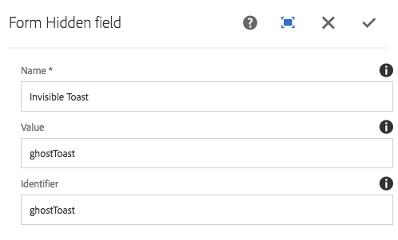

# Componente oculto de formulario (v 1){#form-hidden-component-v}

El componente Formulario de componente principal permite mostrar un campo oculto.

## Uso {#usage}

El componente Oculto Formulario de componente principal permite crear campos ocultos para pasar información sobre la página actual de nuevo a AEM y está pensada para utilizarse junto con [el componente Contenedor de formulario](form-container.md).

El editor de contenido puede definir las propiedades del campo en el cuadro de diálogo [de configuración](#configure-dialog).

## Versión y compatibilidad {#version-and-compatibility}

Este documento describe la versión 1 del componente Oculto de formulario, introducido originalmente con la versión 1.0.0 de los componentes principales con AEM 6.3.

La siguiente tabla muestra la compatibilidad de v 1 del componente Oculto de formulario.

| Versión de AEM | Componente oculto de formulario v 1 |
|--- |--- |
| 6.3 | Compatible |
| 6.4 | Compatible |

>[!CAUTION]
>
>Este documento describe v 1 del componente Oculto de formulario.
>
>Para obtener más información sobre la versión actual del componente Oculto de formulario, consulte [el documento Componente](form-hidden.md) oculto de formulario.

## Salida de componente de muestra {#sample-component-output}

La siguiente es una muestra tomada de [We. Retail](https://helpx.adobe.com/experience-manager/6-4/sites/developing/using/we-retail.html).

### HTML {#html}

```
<div class="cmp cmp-form aem-GridColumn aem-GridColumn--default--12">
 <form method="POST" action="/content/we-retail/us/en/experience.html" id="new_form" name="new_form" enctype="multipart/form-data" class="aem-Grid aem-Grid--12 aem-Grid--default--12 ">
  <input type="hidden" name=":formstart" value="/content/we-retail/us/en/experience/jcr:content/root/responsivegrid/container">
   <div class="visible aem-GridColumn aem-GridColumn--default--12">
    <input type="hidden" id="ghostToast" name="Invisible Toast" value="ghostToast">
   </div>
 </form>
</div>
```

### JSON {#json}

```
"container": {
              "columnClassNames": "aem-GridColumn aem-GridColumn--default--12",
              "columnCount": 12,
              "gridClassNames": "aem-Grid aem-Grid--12 aem-Grid--default--12",
              ":items": {
                "hidden": {
                  "columnClassNames": "aem-GridColumn aem-GridColumn--default--12",
                  ":type": "weretail/components/form/hidden",
                  "name": "Invisible Toast",
                  "id": "ghostToast",
                  "value": "ghostToast"
                }
              },
              ":itemsOrder": [
                "hidden"
              ],
              ":type": "weretail/components/form/container"
            }
```

>[!NOTE]
>
>La exportación JSON de los componentes principales requiere la versión 1.1.0 de los componentes principales. Consulte la información [de compatibilidad de Componentes principales v 1](versions.md#release-history-and-compatibility) para obtener más información.

## Configurar cuadro de diálogo {#configure-dialog}

El cuadro de diálogo de configuración permite al autor de contenido definir los parámetros del campo oculto.



* **Nombre** : el nombre del campo que se envía con los datos del formulario.
* **Valor** : valor del campo que se envía con los datos del formulario.
* **Identificador** : El identificador debe ser único en la página y se puede utilizar para enlazar secuencias de comandos a este campo de formulario

## Cuadro de diálogo de diseño {#design-dialog}

No hay un cuadro de diálogo de diseño para el componente Formulario oculto.

## Detalles técnicos {#technical-details}

La documentación técnica más reciente sobre el componente oculto de formulario [se encuentra en github](https://github.com/adobe/aem-core-wcm-components/tree/master/content/src/content/jcr_root/apps/core/wcm/components/form/hidden/v1/hidden).

Todo el proyecto de componentes principales se puede descargar desde github.

Encontrará más información sobre el desarrollo de componentes principales en la documentación del desarrollador de componentes [principales](developing.md).
