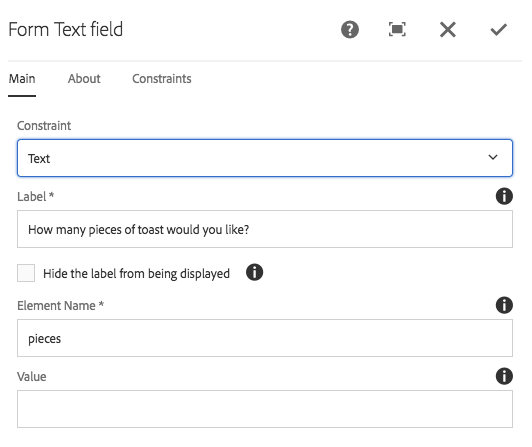
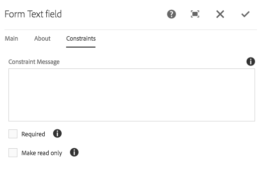

# Form Text Component (v1){#form-text-component-v}

El componente Texto del formulario de componente principal permite introducir el texto del formulario para enviarlo.

## Uso {#usage}

El componente Texto del formulario permite enviar distintos tipos de texto y está diseñado para utilizarse junto con el componente [contenedor del](form-container.md)formulario.

El editor de contenido puede definir el tipo de validación de texto, etiquetas y mensajes de ayuda en el cuadro de diálogo [](form-text-v1.md#main-pars_title)configurar.

## Versión y compatibilidad {#version-and-compatibility}

Este documento describe la versión 1 del componente de texto de formulario, introducido originalmente con la versión 1.0.0 de los componentes principales con AEM 6.3.

En la tabla siguiente se muestra la compatibilidad de v1 del componente de texto de formulario.

| Versión de AEM | Componente de texto de formulario v1 |
|--- |--- |
| 6.3 | Compatible |
| 6.4 | Compatible |

>[!CAUTION]
>
>Este documento describe la versión 1 del componente de texto de formulario.
>
>Para obtener más información sobre la versión actual del componente de texto de formulario, consulte el documento Componente [de texto de](form-text.md) formulario.

## Ejemplo de salida de componente {#sample-component-output}

El siguiente es un ejemplo tomado de [We.Retail](https://helpx.adobe.com/experience-manager/6-4/sites/developing/using/we-retail.html).

### Captura de pantalla {#screenshot}


### HTML {#html}

```
<div class="cmp cmp-form aem-GridColumn aem-GridColumn--default--12">
 <form method="POST" action="/content/we-retail/us/en/experience.html" id="new_form" name="new_form" enctype="multipart/form-data" class="aem-Grid aem-Grid--12 aem-Grid--default--12 ">
     <input type="hidden" name=":formstart" value="/content/we-retail/us/en/experience/jcr:content/root/responsivegrid/container">
     <div class="cmp cmp-form-field aem-GridColumn aem-GridColumn--default--12">
   <div class="form-group">
       <label for="form-text-978484744">How many pieces of toast would you like?</label>
          <input type="number" id="form-text-978484744" name="pieces">
   </div>
  </div>
 </form>
</div>
```

### JSON {#json}

```
"container": {
              "columnClassNames": "aem-GridColumn aem-GridColumn--default--12",
              "columnCount": 12,
              "gridClassNames": "aem-Grid aem-Grid--12 aem-Grid--default--12",
              ":items": {
                "text": {
                  "columnClassNames": "aem-GridColumn aem-GridColumn--default--12",
                  ":type": "weretail/components/form/text",
                  "name": "piecesOfToast",
                  "jcr:title": "How many pieces of toast would you like?",
                  "type": "number",
                  "rows": "2"
                }
              },
              ":itemsOrder": [
                "text"
              ],
              ":type": "weretail/components/form/container"
            }
```

>[!NOTE]
>
>La exportación de JSON desde los componentes principales requiere la versión 1.1.0 de los componentes principales. Consulte la información de [compatibilidad de los componentes principales v1](versions.md#main-pars_title_236368006) para obtener más información.

## Configurar cuadro de diálogo {#configure-dialog}

El cuadro de diálogo de configuración permite al autor del contenido definir el tipo de texto que se debe introducir, así como los valores y etiquetas predeterminados.

### Principal {#main}



* **Restricción** : tipo de texto que se va a introducir y se validará con

   * **Texto**
   * **Área de texto**
   * **Correo electrónico**
   * **Tel.**
   * **Fecha**
   * **Número**
   * **Contraseña**

* **Líneas** de texto: número de líneas que se van a mostrar en el área de texto (solo se muestran cuando **Restricción** se define como Área **de** texto)

* **Etiqueta** : la etiqueta que se mostrará para el campo
* **Ocultar la etiqueta para que no se muestre** : Necesario si la etiqueta solo es necesaria para fines de accesibilidad y no proporciona información visual adicional sobre el campo
* **Nombre** del elemento: el nombre del campo que se envía con los datos del formulario
* **Valor** : valor predeterminado que se rellena previamente en el campo

### Acerca de {#about}


* **Mensaje** de ayuda: una sugerencia para el usuario de lo que se puede introducir en el campo
* **Mostrar mensaje de ayuda como marcador de posición** : para mostrar el mensaje de ayuda dentro de la entrada del formulario cuando está vacío y no está centrado

### Restricciones {#constraints}



* **Mensaje de restricción**

   * El mensaje se muestra como información cuando se envía el formulario si el valor no valida el tipo elegido
   * No se muestra para los tipos de restricción **Texto** y Área **de texto**

* **Obligatorio** : si se selecciona, el usuario debe rellenar un valor antes de enviar el formulario
* **Convertir en solo** lectura: si se selecciona, el usuario no puede modificar el valor del campo

## Cuadro de diálogo Diseño {#design-dialog}

No hay ningún cuadro de diálogo de diseño para el componente Texto de formulario.

## Detalles técnicos {#technical-details}

La documentación técnica más reciente sobre el componente Texto del formulario [puede encontrarse en GitHub](https://github.com/adobe/aem-core-wcm-components/tree/master/content/src/content/jcr_root/apps/core/wcm/components/form/text/v1/text).

Todo el proyecto de componentes principales se puede descargar desde GitHub.

Encontrará más detalles sobre el desarrollo de los componentes principales en la documentación [para desarrolladores de los componentes](developing.md)principales.
