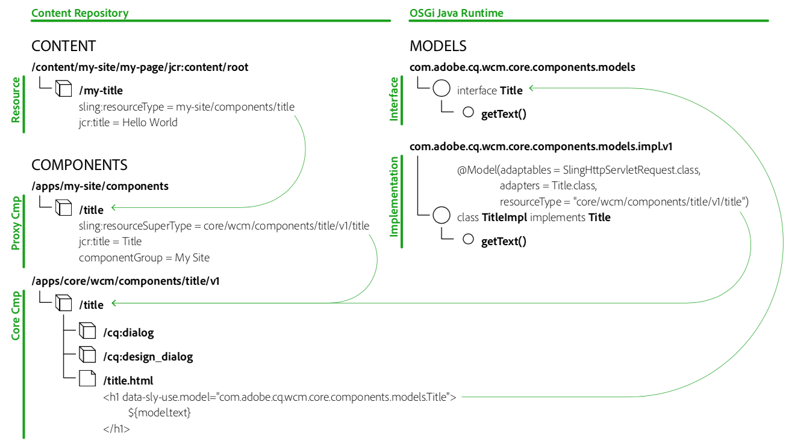

# Directrices de componentes {#component-guidelines}

Los componentes [principales](developing.md) siguen patrones de implementación modernos que son muy diferentes de los componentes de base.

Esta página explica estos patrones y cuándo utilizarlos para crear sus propios componentes confiables. La primera sección [de Patrones de componente General](guidelines.md) se aplica a cualquier tipo de componente, mientras que la segunda sección [Patrones reutilizables se](guidelines.md) aplica a componentes que se van a reutilizar en sitios o proyectos, como los componentes principales.

## Patrones de componente generales {#general-component-patterns}

Las directrices de esta sección se recomiendan para cualquier clase de componente, independientemente de si el componente es específico de un único proyecto o si el componente está diseñado para reutilizarse ampliamente entre sitios o proyectos.

### Componentes configurables {#configurable-components}

Los componentes pueden tener cuadros de diálogo con diversas opciones. Esto debe aprovecharse para hacer que los componentes sean flexibles y configurables, y para evitar implementar varios componentes que principalmente sean variaciones entre sí.

Normalmente, si una estructura metálica o diseño contiene variaciones de elementos similares, estas variaciones no deberían implementarse como componentes distintos, sino como un componente con opciones para elegir entre las variaciones.

Para realizar esto un paso más, si se reutilizan componentes en sitios o proyectos, consulte [la sección Capacidades](#pre-configurable-capabilities) preconfigurables.

### Separación de las preocupaciones {#separation-of-concerns}

Mantener la lógica (o modelo) de un componente separado de la plantilla de marcado (o visualización) suele ser una práctica recomendada. Existen varias formas de conseguirlo, pero la recomendación recomendada es utilizar [Modelos de Sling](https://sling.apache.org/documentation/bundles/models.html) para la lógica y el Lenguaje de plantilla [HTML](https://helpx.adobe.com/experience-manager/htl/using/overview.html) (HTL) para la marca, como también los Componentes principales.

Sling Models es un conjunto de anotaciones Java para acceder fácilmente a las variables necesarias desde pojos y, por lo tanto, ofrece una manera sencilla, potente y de rendimiento de implementar la lógica de Java para componentes.

HTL ha sido diseñado para ser un lenguaje de plantilla seguro y sencillo que se adapta a AEM. Puede llamar a muchas formas de lógica, lo que hace que sea muy flexible.

## Patrones de componente reutilizables {#reusable-component-patterns}

Las directrices de esta sección se pueden utilizar también para cualquier tipo de componente, pero son más útiles para los componentes que se van a reutilizar en sitios o proyectos, como los componentes principales. Por lo tanto, estas directrices se pueden ignorar para componentes que solo se utilizan en un solo sitio o proyecto.

### Capacidades preconfigurables {#pre-configurable-capabilities}

Además del cuadro de diálogo de edición que utilizan los autores de páginas, los componentes también pueden tener un cuadro de diálogo de diseño para que los autores de plantillas puedan preconfigurarlos. El Editor [de plantillas](https://helpx.adobe.com/experience-manager/6-5/sites/authoring/using/templates.html) permite configurar todas estas preconfiguraciones, las cuales se denominan «Políticas».

Para hacer que los componentes sean lo más reutilizables posibles, deben proporcionarse opciones significativas para preconfigurar. Esto permite habilitar o deshabilitar las características de los componentes para que coincidan con las necesidades específicas de los distintos sitios.

<!-- 

Comment Type: annotation
Last Modified By: ims-author-CE1E2CE451D1F0680A490D45@AdobeID
Last Modified Date: 2017-04-17T17:49:04.584-0400

Unclear how I can add my own capability toggle (for example, if i extend a component and want to toggle that extended functionality ... )

 -->

### Patrón de componente proxy {#proxy-component-pattern}

Dado que cada recurso de contenido tiene `sling:resourceType` una propiedad que hace referencia al componente para procesarlo, normalmente se recomienda que estas propiedades apunten a componentes específicos del sitio, en lugar de apuntar a componentes compartidos por varios sitios. Esto ofrecerá mayor flexibilidad y evitará la refactorización de contenido si un sitio necesita un comportamiento diferente para un componente, ya que esta personalización se puede alcanzar en el componente específico del sitio y no afectará a los demás sitios.

Sin embargo, para que los componentes específicos del proyecto no duplicen ningún código, deben hacer referencia al componente principal compartido con la `sling:resourceSuperType` propiedad. Estos componentes específicos del proyecto que hacen referencia principalmente a los componentes principales se denominan «componentes proxy». Los componentes proxy pueden estar completamente vacíos si heredan completamente la funcionalidad, o pueden redefinir algunos aspectos del componente.

### Control de versiones de componentes {#component-versioning}

Los componentes deben ser totalmente compatibles con el tiempo, pero a veces se necesitan cambios que no puedan mantenerse compatibles. Una solución a estas necesidades opuestas es introducir la versión de componentes agregando un número en la ruta de tipo de recurso y en los nombres de clases Java completos de sus implementaciones. Este número de versión representa una versión principal, tal como se define en [las directrices de versiones semánticas](https://semver.org/), que se incrementa solo en los cambios que no son retrocompatibles.

Los cambios incompatibles de los siguientes aspectos de los componentes darán como resultado una nueva versión de los mismos:

* Modelos Sling (siguiendo las directrices de versiones semánticas)
* Secuencias de comandos y plantillas HTL
* Selectores HTML Markup y CSS
* Representación JSON
* Cuadros de diálogo

Para obtener más información, consulte [el documento Políticas](https://github.com/adobe/aem-core-wcm-components/wiki/Versioning-Policies) de versiones en github.

La creación de versiones de componentes crea una forma de contrato que es importante para las actualizaciones, ya que aclara cuándo es necesario volver a factorizar algo. Consulte también la sección [Actualización de la compatibilidad de las personalizaciones](customizing.md#upgrade-compatibility-of-customizations), que explica qué consideraciones requieren distintas formas de personalizaciones para actualizar.

Para evitar migraciones de contenido doloroso, es importante que nunca señale directamente componentes de versiones de recursos de contenido. Como regla de miniaturas, un `sling:resourceType` contenido no debe tener nunca un número de versión, o bien, actualizar componentes requerirá que el contenido se refacture también. La mejor manera de evitar esto es seguir el [patrón de componente proxy](#proxy-component-pattern) descrito anteriormente.

### Interfaces modelo {#model-interfaces}

Este patrón es acerca `data-sly-use` de la instrucción de HTL para señalar a una interfaz Java, mientras que la implementación de Sling Model también se registra en el tipo de recurso del componente.

Cuando se combina con el [patrón de componente proxy](#proxy-component-pattern) descrito anteriormente, esta forma de enlace doble ofrece siguientes puntos de extensión:

1. Un sitio puede redefinir la implementación de un modelo de Sling registrándolo en el tipo de recurso del componente proxy, sin tener que tener en cuenta el archivo HTL, que todavía puede apuntar a la interfaz.
1. Un sitio puede redefinir la marca HTL de un componente, sin tener que tener en cuenta la lógica de implementación a la que debería apuntar.

## Colóquelo todos juntos {#putting-it-all-together}

A continuación se muestra una descripción general de toda la estructura de enlace del tipo de recurso, tomando el ejemplo del componente Core Core. Muestra cómo un componente proxy específico del sitio permite resolver la versión de los componentes, para evitar que el recurso de contenido contenga cualquier número de versión. A continuación, muestra cómo el archivo `title.html`[HTL](https://helpx.adobe.com/experience-manager/htl/using/overview.html) del componente utiliza la interfaz del modelo, mientras que la implementación se enlaza a la versión específica del componente mediante [anotaciones de Modelo](https://sling.apache.org/documentation/bundles/models.html) Sling.

A continuación se proporciona otra información general que no muestra los detalles del POJO de implementación, sino que muestra cómo se hace referencia a [las plantillas y políticas](https://helpx.adobe.com/experience-manager/6-5/sites/developing/using/page-templates-editable.html) asociadas.

La `cq:allowedTemplates` propiedad indica qué plantillas se pueden utilizar para un sitio y `cq:template` la indica a cada página cuál es la plantilla asociada. Cada plantilla está formada por tres partes siguientes:

* **estructura**
Contiene los recursos que se forzarán a que cada página esté presente y que no se pueda eliminar el autor de la página, por ejemplo, los componentes de encabezado de página y pie de página.
* **initial**
Contiene el contenido inicial que se duplicará a la página cuando se crea.
* **políticas**
Contiene para cada componente la asignación a una política, que es la preconfiguración del componente. Esta asignación permite que las políticas se reutilicen en plantillas y, por lo tanto, se gestionen de forma centralizada.

**Siguiente:**

* [Uso de componentes](using.md) principales: familiarícese con los componentes principales en su propio proyecto.
* [Personalización de componentes](customizing.md) principales: para aprender a diseñar y personalizar los componentes principales.
