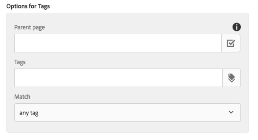

# Componente de lista{#list-component}

El componente Lista de componentes principales permite crear fácilmente listas dinámicas y estáticas.

## Uso {#usage}

El componente Lista puede utilizarse para crear, por ejemplo, una lista dinámica de páginas secundarias o una lista estática de elementos definidos arbitrariamente. El autor de plantillas puede definir el tipo de listas disponibles y las opciones de formato en el cuadro de diálogo [de diseño](#design-dialog). El editor de contenido puede seleccionar los tipos de lista disponibles y cómo dar formato a los elementos de la lista en el cuadro de diálogo [de edición](#edit-dialog).

## Versión y compatibilidad {#version-and-compatibility}

La versión actual del componente de lista es v 2, introducida con la versión 2.0.0 de los componentes principales en enero de 2018, y se describe en este documento.

En la tabla siguiente se detallan todas las versiones compatibles del componente, las versiones AEM con las que son compatibles las versiones del componente y los vínculos a documentación de versiones anteriores.

| Versión del componente | AEM 6.3 | AEM 6.4 | AEM 6.5 |
|--- |--- |--- |--- |
| v2 | Compatible | Compatible | Compatible |
| [v1](list-v1.md) | Compatible | Compatible | Compatible |

Para obtener más información sobre versiones y versiones de componentes principales, consulte las [versiones del documento Versiones principales](versions.md).

## Salida de componente de muestra {#sample-component-output}

La siguiente es una muestra tomada de [We. Retail](https://helpx.adobe.com/experience-manager/6-5/sites/developing/using/we-retail.html).

### Captura de pantalla {#screenshot}

### Biblioteca de componentes

Para experimentar el componente Lista, así como ver ejemplos de opciones de configuración, así como HTML y JSON, visite la Biblioteca [de componentes](http://opensource.adobe.com/aem-core-wcm-components/library/list.html).

### Detalles técnicos {#technical-details}

La documentación técnica más reciente sobre el componente [Lista se encuentra en github](https://github.com/adobe/aem-core-wcm-components/blob/master/content/src/content/jcr_root/apps/core/wcm/components/list/v2/list).

Encontrará más información sobre el desarrollo de componentes principales en la documentación del desarrollador de componentes [principales](developing.md).

## Editar cuadro de diálogo {#edit-dialog}

El cuadro de diálogo de edición permite al autor de contenido configurar la lista y los elementos de lista.

### Ficha Configuración de lista {#list-settings-tab}

La lista puede generarse de diferentes maneras.

* [Páginas secundarias](#child-pages)
* [Lista fija](#fixed-list)
* [Buscar](#search-options)
* [Etiquetas](#tags)

Independientemente de cómo se genere la lista, hay Opciones [de orden](#sort-options) que siempre pueden configurarse.

Según cómo elija el autor de contenido crear la lista, las opciones de configuración adicionales cambiarán.

#### Páginas secundarias {#child-pages}

La lista puede generarse de las páginas secundarias de la página actual u otra página.

* **Página principal**
   * Página cuyas páginas secundarias deben hacer la lista
   * Deje en blanco para utilizar la página actual

* **Profundidad secundaria**
en la que se deben utilizar los niveles inferiores en la jerarquía

#### Lista fija {#fixed-list}

La lista se puede crear con una lista fija de elementos.

Toque o haga clic en el **botón Agregar** para insertar un nuevo elemento en la lista.

* Introduzca el texto del elemento en la lista o utilice el cuadro de diálogo **Selección** para elegir un elemento de AEM.
* Utilice el control de arrastrar para reorganizar los elementos en la lista.
* Utilice el icono de la papelera para eliminar elementos de la lista.

#### Búsqueda {#search-options}

La lista se puede crear con los resultados de una búsqueda del contenido de AEM.

* **Consulta
de búsqueda** La cadena para la que se ejecutará una búsqueda de texto completo para generar los elementos de la lista
* **Buscar en**
dónde se debe ejecutar la búsqueda
   * Utilizar el cuadro de diálogo **Selección** para elegir la ubicación en AEM
   * Utilizar la página actual si se deja en blanco

#### Etiquetas {#tags}

La lista se puede crear utilizando páginas que coincidan con determinadas etiquetas en una ubicación determinada.

* **Página
principal** donde la coincidencia de etiquetas debería comenzar
   * Utilizar el cuadro de diálogo **Selección** para elegir la ubicación en AEM
   * Utilizar la página actual si se deja en blanco
* **Etiquetas**
que deben coincidir con etiquetas
   * Uso del cuadro **de** diálogo Examinar para seleccionar las etiquetas
* **Coincide**
Definir qué clase de coincidencia debe calificar una página para incluirla en la lista
   * **cualquier etiqueta**
   * **todas las etiquetas**

#### Opciones de ordenación {#sort-options}

Independientemente de cómo elija crear la lista, hay determinadas opciones de clasificación que siempre se pueden definir.

* **Ordenar por**
cómo deben ordenarse los elementos
   * **Título**
   * **Fecha de la última modificación**
* **Ordenar El**
orden en el que deben ordenarse los elementos
   * **ascendente**
   * **descendente**
* **Número máximo de elementos**
Número máximo de elementos mostrados en la lista.
   * Deje vacío para devolver todos los elementos.

### Ficha Configuración del elemento {#item-settings-tab}

Con la ficha Ajustes del elemento, se puede configurar el formato de los elementos de lista.

* **Vincular elementos**
Vínculo Elementos a la página correspondiente
* **Mostrar descripción**
Mostrar descripción del elemento del vínculo
* **Mostrar fecha**de modificación Mostrar fecha
del elemento del vínculo

## Cuadro de diálogo de diseño {#design-dialog}

El cuadro de diálogo de diseño permite que el autor de la plantilla defina los tipos de listas que deben permitirse los autores de contenido, así como los ajustes de elementos disponibles.

### Ajustes de la lista {#list-settings}

En la ficha **Configuración** de lista, se puede definir el formato de fecha, así como el tipo de listas que debe estar disponible en el componente a los autores de contenido.

* **Formato de formato**
de fecha que se utilizará para la visualización de la última fecha de modificación
* **Deshabilitar elementos secundarios**
Deshabilitar el tipo de lista secundarios en el componente
* **Deshabilitar deshabilitar estático**
el tipo de lista estática del componente
* **Deshabilitar búsqueda**
Deshabilitar el tipo de lista de búsqueda en el componente
* **Deshabilitación de etiquetas**
Deshabilitar el tipo de lista de etiquetas en el componente

### Ajustes del elemento {#item-settings}

En la ficha **Ajustes** del elemento, se pueden definir las opciones de formato de los elementos de lista individuales que deben estar disponibles en el componente para los autores de contenido.

* **Activar elementos de vínculo** La opción Elementos de vínculo en el cuadro [de diálogo de edición](#edit-dialog)
* **Mostrar descripciones**
Habilitar la opción Mostrar descripciones en el cuadro de diálogo [de edición](#edit-dialog)
* **Mostrar fecha**
de habilitación de fecha Mostrar fecha en el cuadro [de diálogo de edición](#edit-dialog)

### Ficha Estilos {#styles-tab}

El componente Imagen admite [el sistema de estilos AEM](authoring.md#component-styling).