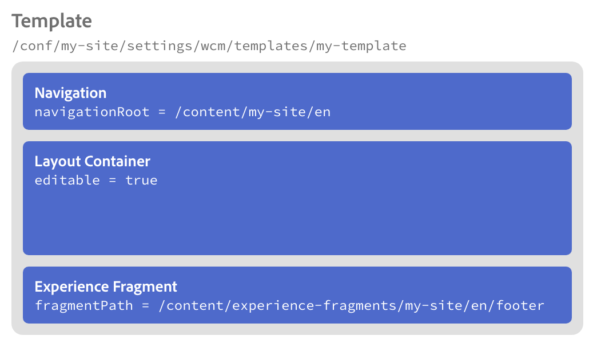

# Características de localización de los componentes principales {#localization-features-of-the-core-components}

Muchos sitios Web requieren que el contenido se entregue en un formato localizado en varios idiomas y regiones geográficas. Los componentes principales seleccionados presentan una solución de referencia inteligente para facilitar la creación de una plantilla unificada para todo el contenido localizado que se adapte automáticamente en función de la estructura del sitio localizado.

## Ejemplo: Página localizada con navegación y pies de página {#example}

La mayoría de los sitios requieren que haya un pie de página en todas las páginas. Estos pies de página generalmente son coherentes en todo el contenido de la página. Sin embargo, para una página de contenido localizada, debe mostrarse una versión localizada de ese encabezado o pie de página.

Del mismo modo, un componente de navegación generalmente debe mostrarse en todas las páginas. Sin embargo, también deberá reflejar el contenido de las páginas localizadas.

Al utilizar las funciones de localización del componente [principal de](navigation.md) navegación y del componente [principal de fragmento de](experience-fragment.md) experiencia junto con las plantillas [editables de AEM](https://docs.adobe.com/content/help/en/experience-manager-64/authoring/siteandpage/templates.html), se convierte en una tarea sencilla. El ejemplo podría ampliarse para utilizar también el componente [de navegación por](language-navigation.md) idiomas.

## La estructura de contenido {#content-structure}

Todas las funciones de localización de AEM y sus componentes principales dependen de una estructura de contenido clara y lógica para el contenido localizado.

Supongamos que su sitio se llama simplemente `my-site` y se encuentra aquí:

```
/content/my-site
```

Supongamos también que crea su sitio en inglés y lo ofrece también en francés. Así que si tiene una página simple llamada `my-page` se encontraría en dos ramas de localización en el árbol de contenido del sitio:

```
/content
\-- my-site
   +-- en
       \-- my-page
   \-- fr
       \-- my-page
```

Es en estas ramas de localización donde creará páginas de sitios adicionales.

Los pies de página generalmente se crean con fragmentos de experiencia, por lo que necesitará una versión en inglés y francés como las páginas. Sin embargo, los fragmentos de experiencia no son páginas, sino partes de páginas que se pueden reutilizar en todas las páginas, por lo que no viven directamente debajo `/content` del resto de las páginas. En su lugar, viven bajo su propia carpeta, pero como también deben estar localizados, su estructura debe reflejar la estructura de localización del sitio.

```
/content
+-- experience-fragments
   +-- en
      \-- footer
   \-- fr
      \-- footer
\-- my-site
   +-- en
      \-- my-page
   \-- fr
      \-- my-page
```

Es a través de la estructura de localización reflejada que los componentes principales pueden encontrar el contenido localizado necesario para una página correspondiente.

## Pie de página: fragmento de experiencias {#xf-footer}

El componente Fragmento de experiencia es muy flexible y es adecuado para un encabezado o pie de página.

Debido a que nuestro sitio web hipotético se ofrece en inglés y francés, necesitaremos crear dos fragmentos de experiencia, ambos llamados `footer` [en las ubicaciones que describimos anteriormente.](#content-structure)


## Plantilla de la página {#template}

Dado que el pie de página aparecerá en todas las páginas, tendremos que agregar el fragmento de experiencias a nuestra plantilla de página estándar.

Nuestra plantilla se llama simplemente `my-template` y se encuentra con nuestras otras plantillas:

```
/conf/my-site/settings/wcm/templates/my-template
```

A esta plantilla agregaremos los componentes básicos en los que queremos basar nuestras páginas.

* [Componente de navegación](navigation.md)
   * El componente de navegación aparecerá en la parte superior de cada página.
   * En el componente de navegación definimos la raíz de navegación, indicando al componente dónde comienza la estructura de navegación del sitio.
   * En función de la raíz de navegación, el componente puede buscar automáticamente el contenido localizado correspondiente.
* [Componente de contenedor](container.md)
   * Cada página contendrá un componente de contenedor editable para que los autores puedan colocar contenido adicional en la página.
* [Fragmento de experiencias](experience-fragment.md)
   * Señalamos el componente Fragmento de experiencia a la ruta de fragmento en el idioma de creación del fragmento que representa el pie de página.
   * En función de la ruta de ese fragmento y de la estructura de los fragmentos de experiencia que reflejan la estructura de página localizada, el componente puede buscar automáticamente el contenido localizado correspondiente.
   

## Páginas {#pages}

Al realizar el trabajo duro en la configuración de la estructura y plantilla del sitio, el autor del contenido simplemente necesita agregar el contenido necesario a las páginas. Gracias a las plantillas y a la lógica de localización de los componentes, la navegación y los pies de página se agregarán automáticamente a la página y se localizarán.

Por ejemplo, el autor sólo tendría que agregar contenido como un componente de texto a las páginas en inglés y francés (representado en azul más abajo).

El componente de navegación y el componente de fragmento de experiencia provienen de la plantilla de página y saben mostrar automáticamente el contenido correcto en función de la estructura de localización y la ubicación de la página en sí (representados en blanco a continuación).


## Adaptarlo a todos juntos {#fitting-it-all-together}

Esta es la imagen completa de cómo estos elementos simples pero poderosos funcionan juntos para ofrecer páginas localizadas para los autores de contenido.


