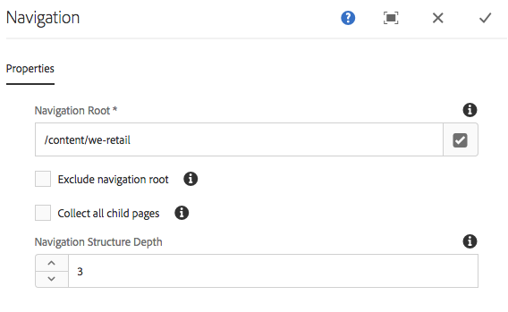

# Navigation Component{#navigation-component}

El componente de navegación permite a los usuarios navegar fácilmente por una estructura globalizada del sitio.

## Uso {#usage}

El componente de navegación permite cualquier jerarquía de navegación que pueda crearse a partir de las copias Live Copies de un modelo, desde las copias de idioma de un maestro de idioma o desde un árbol simple de páginas. Permite a los usuarios de la página navegar fácilmente por una estructura del sitio.

The [edit dialog](#edit-dialog) allows the content author to define the navigation root page along with the depth of navigation. The [design dialog](#design-dialog) allows the template author to define default values for the navigation root and depth.

## Version and Compatibility {#version-and-compatibility}

La versión actual del componente de navegación es v 1, introducida con la versión 2.0.0 de los componentes principales en enero de 2018, y se describe en este documento.

En la tabla siguiente se detallan todas las versiones compatibles del componente, las versiones AEM con las que son compatibles las versiones del componente y los vínculos a documentación de versiones anteriores.

| Versión del componente | AEM 6.3 | AEM 6.4 | AEM 6.5 |
|--- |--- |--- |--- |
| v1 | Compatible | Compatible | Compatible |

For more information about Core Component versions and releases, see the document [Core Components Versions](versions.md).

## Sample Component Output {#sample-component-output}

To experience the Navigation Component as well as see examples of its configuration options as well as HTML and JSON output, visit the [Component Library](http://opensource.adobe.com/aem-core-wcm-components/library/navigation.html).

## Technical Details {#technical-details}

The latest technical documentation about the Navigation Component [can be found on GitHub](https://github.com/adobe/aem-core-wcm-components/blob/master/content/src/content/jcr_root/apps/core/wcm/components/navigation/v1/navigation).

Further details about developing Core Components can be found in the [Core Components developer documentation](developing.md.

>[!NOTE]
>
>As of Core Components release 2.1.0, the Navigation Component supports [schema.org microdata](https://schema.org).

## Edit Dialog {#edit-dialog}

En el cuadro de diálogo de edición, el autor de contenido puede definir la página raíz para la navegación y la profundidad de la estructura de navegación.

* **Raíz
de navegación** La página raíz, que se utilizará para generar el árbol de navegación.
* **Excluir raíz
de navegación** Excluir la raíz de navegación en el árbol resultante, incluir solo a sus descendientes.
* **Recopilación de todas las páginas**
secundarias Recopile todas las páginas que sean descendientes de la raíz de navegación.
* **Profundidad
de estructura de navegación** Define cuántos niveles en el árbol de navegación se deben mostrar en relación con la raíz de navegación (solo disponible cuando **no se selecciona la opción Recopilación de todas las páginas** secundarias).

## Design Dialog {#design-dialog}

El cuadro de diálogo de diseño permite que el autor de la plantilla establezca los valores predeterminados para la página raíz de navegación y la profundidad de navegación que se presentan a los autores de contenido.

### Properties Tab {#properties-tab}

* **Raíz de navegación El**
valor predeterminado de la página raíz de la estructura de navegación, que se utilizará para generar el árbol de navegación y predeterminado cuando el autor de contenido agrega el componente a la página.
* **Excluir raíz
de navegación** El valor predeterminado de la opción para excluir la raíz de navegación en el árbol resultante.
* **Recopilación de todas las páginas**
secundarias El valor predeterminado de la opción para recopilar todas las páginas que sean descendientes de la raíz de navegación.
* **Profundidad de la estructura de navegación El**
valor predeterminado de la profundidad de la estructura de navegación.

### Styles Tab {#styles-tab}

The Navigation Component supports the AEM [Style System](authoring.md#component-styling).