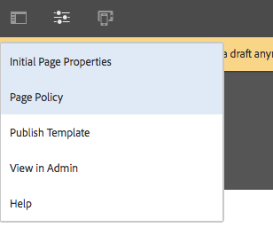
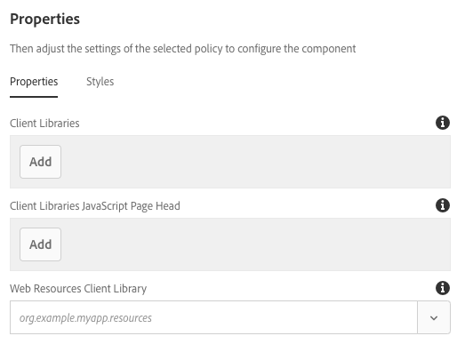

# Componente de página{#page-component}

El componente de página es un componente de página extensible diseñado para trabajar con el editor [de plantillas](https://helpx.adobe.com/experience-manager/6-5/sites/authoring/using/templates.html) y permite que los componentes de encabezado/pie de página y estructura de página se creen con el editor de plantillas.

## Uso {#usage}

El componente de página constituye la base de todas las páginas diseñadas con los componentes principales, así como plantillas editables. Al utilizar el componente de página, encabezados, pies de página y la estructura de la página, se puede definir como plantilla con los demás componentes principales.

Con el cuadro de diálogo [de diseño](#design-dialog), se pueden definir bibliotecas personalizadas del lado del cliente para la página. A diferencia de otros componentes que tienen un cuadro de diálogo de edición accesible directamente desde el componente, dado que el componente es la propia página, el cuadro [de diálogo de edición](#edit-dialog) del componente de página es la ventana de propiedades de página.

## Versión y compatibilidad {#version-and-compatibility}

La versión actual del componente de página es v 2, que se introdujo con la versión 2.0.0 de los componentes principales en enero de 2018 y se describe en este documento.

En la tabla siguiente se detallan todas las versiones compatibles del componente, las versiones AEM con las que son compatibles las versiones del componente y los vínculos a documentación de versiones anteriores.

| Versión del componente | AEM 6.3 | AEM 6.4 | AEM 6.5 |
|---|---|---|---|
| [v2](page-v1.md) | Compatible | Compatible | Compatible |
| v1 | Compatible | Compatible | Compatible |

Para obtener más información sobre versiones y versiones de componentes principales, consulte las [versiones del documento Versiones principales](versions.md).

>[!NOTE]
>
>Para habilitar redireccionamiento en `cq:Page` el nivel para el número 2 del componente de página y AEM 6.3, [se requiere service pack 2](https://helpx.adobe.com/experience-manager/6-3/release-notes/sp2-release-notes.html) o posterior. Dicho redireccionamiento no estaba disponible en versiones anteriores.

## Salida de componente de muestra {#sample-component-output}

La siguiente es una muestra tomada de [We. Retail](https://helpx.adobe.com/experience-manager/6-5/sites/developing/using/we-retail.html).

### Captura de pantalla {#screenshot}

### Detalles técnicos {#technical-details}

La documentación técnica más reciente sobre el componente de página [se encuentra en github](https://github.com/adobe/aem-core-wcm-components/blob/master/content/src/content/jcr_root/apps/core/wcm/components/page/v2/page).

Encontrará más información sobre el desarrollo de componentes principales en la documentación del desarrollador de componentes [principales](developing.md).

## Editar cuadro de diálogo {#edit-dialog}

Dado que el componente representa toda la página, los ajustes que normalmente estarían en un cuadro de diálogo de edición se encuentran en [la ventana Propiedades](https://helpx.adobe.com/experience-manager/6-5/sites/authoring/using/editing-page-properties.html) de página.

## Cuadro de diálogo de diseño {#design-dialog}

Dado que el componente representa toda la página, se accede al cuadro de diálogo de diseño a través **de Información de página -&gt; Política** de página al editar la plantilla de página.

>[!NOTE]
>
>En versiones anteriores de AEM, la Directiva **de página** se llamaba **Diseño de página**.

### Ficha Propiedades {#properties-tab}

Con la ventana Diseño de página, puede definir las bibliotecas de cliente que se deben cargar, así como la biblioteca de recursos web para la página.

* **Bibliotecas
de cliente** Define las categorías de la biblioteca cliente que se van a cargar. JavaScript se agrega en el extremo body y CSS se agrega al encabezado de la página.
* **Biblioteca de clientes JavaScript Head Head**
Esta definición define las categorías de biblioteca cliente de JavaScript que se cargarán en el encabezado de página.
   * Las categorías definidas aquí que están también presentes en **el campo Bibliotecas** de cliente tendrán JavaScript cargado en el encabezado de página en lugar de en el final del cuerpo.
   * No se cargará CSS a menos que la categoría también esté presente en el campo **Bibliotecas** de cliente.

* **Recursos web Biblioteca
de cliente** La categoría de biblioteca de cliente que se utiliza para servir recursos Web como los favoritos.

Las bibliotecas se pueden configurar para los campos Biblioteca **de cliente** y Biblioteca **de clientes JavaScript de** la página de cliente de la siguiente manera:

* Para agregar un nuevo campo o toque el **botón Agregar** debajo de los campos.
* Para quitar un campo o tocar el icono de la papelera, haga clic al lado del campo para eliminarlo.
* Para reorganizar el orden de carga, toque o haga clic en él y arrastre el indicador al lado del campo que desee mover.

Para obtener más información sobre el uso de bibliotecas de cliente, consulte [Uso de bibliotecas de cliente](https://helpx.adobe.com/experience-manager/6-5/sites/developing/using/clientlibs.html).

>[!CAUTION]
>
>La capacidad para definir por separado bibliotecas de cliente para el encabezado de página se introdujo con la versión 2.2.0 de componentes principales.

### Ficha Estilos {#styles-tab}

El componente de página admite el sistema [de estilos AEM](authoring.md#component-styling).