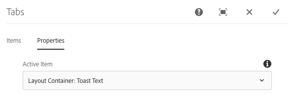

# Componente Fichas

El componente Fichas de componente principal permite la organización de contenido en varias fichas.

## Uso {#usage}

El componente Fichas permite que el autor del contenido organice el contenido de la página en varias fichas.

El cuadro de diálogo [de edición](#edit-dialog) permite al autor de contenido definir varias fichas, así como establecer la ficha activa. Con el cuadro de diálogo [de diseño](#design-dialog), el autor de la plantilla puede definir qué componentes se pueden agregar a las fichas y personalizar los estilos.

>[!NOTE]
>
>Se admiten componentes de fichas anidados (fichas dentro de fichas).
>
>Los componentes de fichas simples (no anidados) pueden ubicarse o seleccionarse con el árbol [de contenido](https://helpx.adobe.com/experience-manager/6-5/sites/authoring/using/author-environment-tools.html), aunque no pueden ser fichas anidadas.

## Versión y compatibilidad {#version-and-compatibility}

La versión actual del componente Fichas es v 1, introducida con la versión 2.2.0 de los componentes principales en octubre de 2018, y se describe en este documento.

En la tabla siguiente se detallan todas las versiones compatibles del componente, las versiones AEM con las que son compatibles las versiones del componente y los vínculos a documentación de versiones anteriores.

| Versión del componente | AEM 6.3 | AEM 6.4 | AEM 6.5 |
|--- |--- |--- |--- |
| v1 | Compatible | Compatible | Compatible |

Para obtener más información sobre versiones y versiones de componentes principales, consulte las [versiones del documento Versiones principales](versions.md).

## Salida de componente de muestra {#sample-component-output}

A continuación se muestra una muestra tomada de [We. Retail](https://helpx.adobe.com/experience-manager/6-5/sites/developing/using/we-retail.html).

### Captura de pantalla {#screenshot}

### Biblioteca de componentes

Para experimentar el componente Fichas, así como ver ejemplos de opciones de configuración, así como HTML y JSON, visite la Biblioteca [de componentes](http://opensource.adobe.com/aem-core-wcm-components/library/tabs.html).

### Detalles técnicos {#technical-details}

La documentación técnica más reciente sobre el componente Fichas [se encuentra en github](https://github.com/adobe/aem-core-wcm-components/blob/master/content/src/content/jcr_root/apps/core/wcm/components/tabs/v1/tabs).

Encontrará más información sobre el desarrollo de componentes principales en la documentación del desarrollador de componentes [principales](developing.md).

## Editar cuadro de diálogo {#edit-dialog}

El cuadro de diálogo de edición permite al autor de contenido crear, renombrar y reorganizar fichas, así como definir la ficha activa.

### Ficha Elementos {#items-tab}

Utilice el botón **Agregar** para abrir el selector de componentes y elegir qué componente agregar como ficha. Una vez agregado, se agrega una entrada a la lista, que contiene las columnas siguientes:

* **Icono** : el icono del tipo de componente de la ficha para facilitar la identificación en la lista. Pase el ratón para ver el nombre completo del componente como información de objeto.
* **Descripción** : La descripción utilizada como texto de la ficha, predeterminada al nombre del componente seleccionado para la ficha.
* **Eliminar** : toque o haga clic para eliminar la ficha del componente de tabulación.
* **Reorganizar** : Toque o haga clic y arrastre para cambiar el orden de las fichas.

### Ficha Propiedades {#properties-tab}

En la ficha **Propiedades** , el autor de contenido puede definir qué ficha está activa cuando se carga la página. Con la opción **Predeterminado** , se seleccionará la primera ficha.

## Seleccionar panel {#select-panel}

El autor de contenido puede utilizar la opción **Seleccionar panel** de la barra de herramientas de componentes para cambiar a un panel diferente para editarlo y reorganizar fácilmente el orden de las fichas.

Una vez seleccionada la opción **Seleccionar panel** en la barra de herramientas del componente, las fichas configuradas se muestran como una lista desplegable.

* La lista se ordena por la organización asignada de las fichas y se refleja en la numeración.
* El tipo de componente de la ficha se muestra primero, seguido de la descripción de la ficha de la fuente más clara.

* Al tocar o hacer clic en una entrada en la lista desplegable, se cambia la vista del editor a esa ficha.
* Las fichas se pueden reorganizar en contexto empleando los controles de arrastrar.

>[!NOTE]
>
>El autor no puede seleccionar las fichas cuando se encuentra en el modo **de edición** . Utilice [**el modo Vista previa**](https://helpx.adobe.com/experience-manager/6-5/sites/authoring/using/editing-content.html) o **[la](https://helpx.adobe.com/experience-manager/6-5/sites/authoring/using/editing-content.html)** opción Ver como publicado para interactuar con las fichas como un lector del contenido publicado.

## Cuadro de diálogo de diseño {#design-dialog}

El cuadro de diálogo de diseño permite que el autor de la plantilla defina qué componentes pueden agregarse como elementos al componente de fichas, así como definir qué estilos personalizados están disponibles para el autor del contenido.

### Ficha Componentes permitidos {#allowed-components-tab}

La **ficha Componentes** permitidos se utiliza para definir qué componentes pueden agregarse como elementos al componente fichas por autor del contenido.

La ficha Componentes permitidos funciona de la misma manera que la ficha del mismo nombre al [definir la política y las propiedades de un contenedor de diseño en el Editor de plantillas.](https://helpx.adobe.com/experience-manager/6-5/sites/authoring/using/templates.html)

### Ficha Estilos {#styles-tab}

El componente Fichas admite el sistema [de estilos AEM](authoring.md#component-styling).