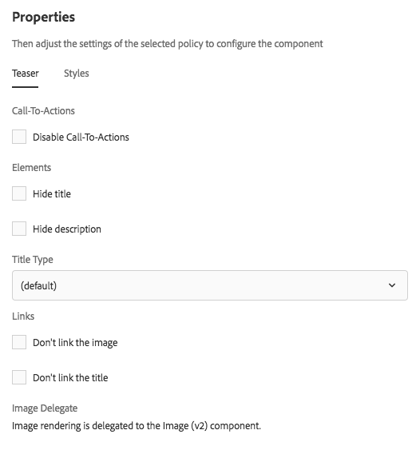

# Componente teaser{#teaser-component}

El componente teaser de componentes principales puede mostrar una imagen, un título, texto enriquecido y, opcionalmente, vincular a otro contenido.

## Uso {#usage}

El componente Teaser permite al autor del contenido crear fácilmente un teaser para añadir contenido mediante una imagen, un título o texto enriquecido y vincularlo a contenido u otras acciones.

El autor de la plantilla puede utilizar el cuadro de diálogo [de](#design-dialog) diseño para definir si están disponibles las opciones para crear llamadas a acción y agregar vínculos, así como desactivar las distintas opciones de visualización. El autor del contenido puede utilizar el cuadro de diálogo [de](#configure-dialog) configuración para establecer una imagen, definir CTA, definir títulos y descripciones y configurar vínculos al teaser individual. Se puede acceder al cuadro de diálogo [de](image.md#edit-dialog) edición del componente [de](image.md) imagen para modificar la imagen de teaser.

## Versión y compatibilidad {#version-and-compatibility}

La versión actual del componente Teaser es v1, que se introdujo con la versión 2.1.0 de los componentes principales en julio de 2018 y se describe en este documento.

En la tabla siguiente se detallan todas las versiones compatibles del componente, las versiones de AEM con las que las versiones del componente son compatibles y los vínculos a la documentación de versiones anteriores.

| Versión del componente | AEM 6.3 | AEM 6.4 | AEM 6.5 |
|---|---|---|---|
| v1 | Compatible | Compatible | Compatible |

## Ejemplo de salida de componente {#sample-component-output}

Para experimentar el componente Teaser y ver ejemplos de sus opciones de configuración, así como la salida HTML y JSON, visite la biblioteca [de](http://opensource.adobe.com/aem-core-wcm-components/library/teaser.html)componentes.

### Detalles técnicos {#technical-details}

La documentación técnica más reciente sobre el componente Teaser [puede encontrarse en GitHub](https://github.com/adobe/aem-core-wcm-components/blob/master/content/src/content/jcr_root/apps/core/wcm/components/teaser/v1/teaser).

Encontrará más detalles sobre el desarrollo de los componentes principales en la documentación [para desarrolladores de los componentes](developing.md)principales.

## Configurar cuadro de diálogo {#configure-dialog}

El autor del contenido puede utilizar el cuadro de diálogo de configuración para definir las propiedades del teaser individual. También hay un cuadro de diálogo [de](#edit-dialog) edición para modificar la imagen de teaser si se selecciona una.

### Imagen {#image}

* **Recurso de imagen**
   * Suelte un recurso del navegador [de](https://helpx.adobe.com/experience-manager/6-5/sites/authoring/using/author-environment-tools.html) recursos o toque la opción de **exploración** para cargarlo desde un sistema de archivos local.
   * Tap or click Clear to de-select the currently selected image.****
   * Toque o haga clic en **Editar** para [administrar las representaciones del recurso](https://helpx.adobe.com/experience-manager/6-5/assets/using/managing-assets-touch-ui.html) en el editor de recursos.

### Texto {#text}

* **Título** Define un título para que se muestre como titular para el teaser.
* **Get title from linked page
When checked, the title will be populated with the linked page's title.**
* **Descripción** Define una descripción para que se muestre como el subtítulo del teaser.
* **Get description from linked page
When checked, the description will be populated with the linked page's description.**

### Links &amp; Actions {#links-actions}

* **Link
Link applied to the teaser.** Use the path browser to select the link target.
* **Enable Call-To-Actions
When checked, enables definition of Call-To-Actions.** The first Call-To-Action link in the list is used as the link for other teaser elements.

## Edit Dialog {#edit-dialog}

The Teaser Component delegates image rendering to the Image Component.  Therefore the edit dialog(image.md#edit-dialog of the Image Component is available to the content author to manipulate the teaser image.[]

## Design Dialog {#design-dialog}

The design dialog allows the template author to define the teaser options that the content author has when using this component.

### Teaser Tab {#teaser-tab}

* **Llamadas a la acción**
   * **Disable Call-To-Actions
Hide the Call-To-Actions option for content authors******
* **Elementos**
   * **Ocultar título**
      * Hides the Title option for content authors ****
      * Cuando se selecciona, el tipo **de** título está oculto
   * **Ocultar descripción** Ocultar la opción **Descripción** para autores de contenido
* **Tipo** de títuloDefine la etiqueta H que utilizará el título del teaser.
* **Vínculos**
   * **No vincular la imagen** Cuando se selecciona, la imagen de teaser no está vinculada
   * **No vincular el título** Cuando se selecciona, el título del teaser no está vinculado

### Ficha Estilos {#styles-tab}

El componente Teaser es compatible con el sistema [de](authoring.md#component-styling)estilo AEM.
