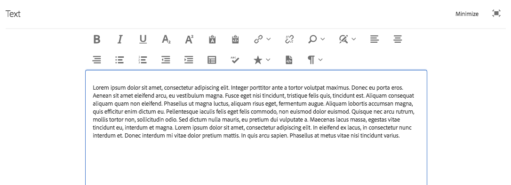
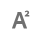
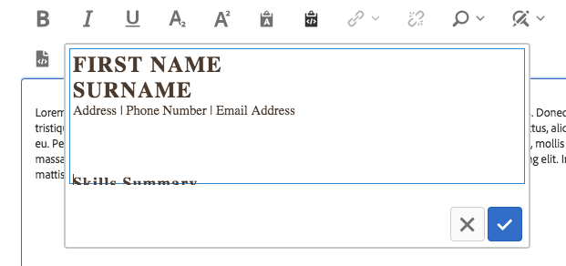
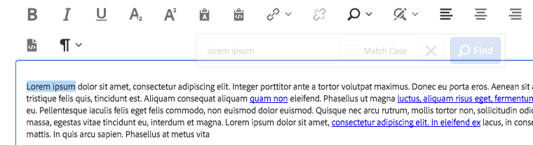
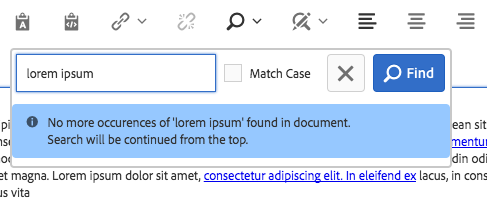
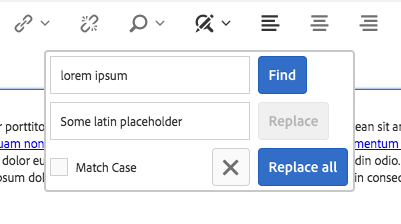
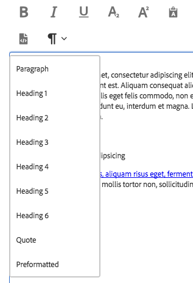

# Text Component (v1){#text-component-v}

El componente Texto es un componente de composición y edición de texto enriquecido que incluye edición in-situ.

## Uso {#usage}

El componente de texto ofrece un potente editor de texto enriquecido que permite una edición de texto sencilla en un editor en línea simplificado y en un formato de pantalla completa.

El cuadro de diálogo [de](text-v1.md#main-pars_title) edición incluye edición en línea con opciones limitadas con funcionalidad completa disponible en el cuadro de diálogo de edición a pantalla completa. Mediante el cuadro de diálogo [de](text-v1.md#main-pars_title_1995166862)diseño, se pueden configurar opciones de formato de texto como encabezados, caracteres especiales y estilos de párrafo para la plantilla del autor del contenido.

## Versión y compatibilidad {#version-and-compatibility}

Este documento describe la versión 1 del componente de texto, introducida originalmente con la versión 1.0.0 de los componentes principales con AEM 6.3.

En la tabla siguiente se muestra la compatibilidad de v1 del componente de texto.

| Versión de AEM | Componente de texto v1 |
|--- |--- |
| 6.3 | Compatible |
| 6.4 | Compatible |

>[!CAUTION]
>
>Este documento describe la versión 1 del componente de texto.
>
>Para obtener más información sobre la versión actual del componente de texto, consulte el documento Componente [de](text.md) texto.

## Ejemplo de salida de componente {#sample-component-output}

El siguiente es un ejemplo tomado de [We.Retail](https://helpx.adobe.com/experience-manager/6-4/sites/developing/using/we-retail.html).

### Captura de pantalla {#screenshot}


### HTML {#html}

```
<div class="cmp cmp-text aem-GridColumn aem-GridColumn--default--12">
<p>Lorem ipsum dolor sit amet, consectetur adipiscing elit. Integer porttitor ante a tortor volutpat maximus. Donec eu porta eros. Aenean sit amet eleifend arcu, eu vestibulum magna. Fusce eget nisi tincidunt, tristique felis quis, tincidunt est. Aliquam consequat aliquam quam non eleifend. Phasellus ut magna luctus, aliquam risus eget, fermentum augue. Aliquam lobortis accumsan magna, quis efficitur enim dictum eu. Pellentesque iaculis felis eget felis commodo, non euismod dolor euismod. Quisque nec arcu rutrum, mollis tortor non, sollicitudin odio. Sed dictum nulla mauris, eu pretium dui vulputate a. Maecenas lacus massa, egestas vitae tincidunt eu, interdum et magna. Lorem ipsum dolor sit amet, consectetur adipiscing elit. In eleifend ex lacus, in consectetur nunc interdum et. Donec interdum mi vitae dolor pretium mattis. In quis arcu sapien. Phasellus at metus vitae nisi tincidunt varius.<br />
</p>
</div>
```

### JSON {#json}

```
"text": {
              "columnClassNames": "aem-GridColumn aem-GridColumn--default--12",
              "text": "<p>Lorem ipsum dolor sit amet, consectetur adipiscing elit. Integer porttitor ante a tortor volutpat maximus. Donec eu porta eros. Aenean sit amet eleifend arcu, eu vestibulum magna. Fusce eget nisi tincidunt, tristique felis quis, tincidunt est. Aliquam consequat aliquam quam non eleifend. Phasellus ut magna luctus, aliquam risus eget, fermentum augue. Aliquam lobortis accumsan magna, quis efficitur enim dictum eu. Pellentesque iaculis felis eget felis commodo, non euismod dolor euismod. Quisque nec arcu rutrum, mollis tortor non, sollicitudin odio. Sed dictum nulla mauris, eu pretium dui vulputate a. Maecenas lacus massa, egestas vitae tincidunt eu, interdum et magna. Lorem ipsum dolor sit amet, consectetur adipiscing elit. In eleifend ex lacus, in consectetur nunc interdum et. Donec interdum mi vitae dolor pretium mattis. In quis arcu sapien. Phasellus at metus vitae nisi tincidunt varius.</p>\n",
              "richText": true,
              ":type": "weretail/components/content/text"
            }
```

>[!NOTE]
>
>La exportación de JSON desde los componentes principales requiere la versión 1.1.0 de los componentes principales. Consulte la información de [compatibilidad de los componentes principales v1](versions.md#main-pars_title_236368006) para obtener más información.

## Edit Dialog {#edit-dialog}

El cuadro de diálogo de edición ofrece las herramientas de formato de texto enriquecido estándar que un usuario espera que compongan texto.



* Negrita

   

   Se utiliza para aplicar formato de negrita al texto seleccionado o para aplicar formato negrita al texto introducido después del cursor.

   **Ctrl+B** se puede utilizar como método abreviado de teclado.

* Cursiva

   

   Se utiliza para aplicar formato en cursiva al texto seleccionado o texto en cursiva introducido después del cursor.

   **Ctrl+I** se puede utilizar como método abreviado de teclado.

* Subrayado

   

   Se utiliza para aplicar formato subrayado al texto seleccionado o para subrayar el texto introducido después del cursor.

   **Ctrl+U** se puede utilizar como método abreviado de teclado.

* Subíndice

   

   Se utiliza para dar formato al texto seleccionado o al texto introducido después del cursor como subíndice.

* Superíndice

   

   Se utiliza para dar formato al texto seleccionado o al texto introducido después del cursor como superíndice.

* Pegar como texto

   

   Pega el texto copiado como texto sin formato sin ningún formato.

   Al seleccionar esta opción, se abre una ventana donde el texto se puede pegar como texto sin formato sin formato como vista previa antes de insertarlo en el texto. Acepte tocando o haciendo clic en la marca de verificación y cancele la acción tocando o haciendo clic en la x.

   

* Pegar desde Word

   

   Al seleccionar esta opción, se abre una ventana donde se puede pegar el texto manteniendo su formato como una vista previa antes de insertarlo en el texto. Acepte tocando o haciendo clic en la marca de verificación y cancele la acción tocando o haciendo clic en la x.

   

* Hipervínculo

   

   Utilice esta opción para convertir el texto seleccionado en un hipervínculo o modificar un vínculo ya definido. Esta opción solo está activa cuando el texto ya está seleccionado y abre una ventana con opciones adicionales para configurar el vínculo.

   

   * Introduzca la ubicación

      * Utilice el cuadro de diálogo Abrir selección para elegir una ruta en AEM
      * Si el vínculo no está dentro de AEM, introduzca la dirección URL absoluta (las rutas no absolutas se interpretan como relativas a AEM)
   * Escriba un texto descriptivo alternativo para el vínculo
   * Seleccionar comportamiento de vínculo

      * Destino
      * Misma ficha
      * Nueva ficha
      * Marco principal
      * Marco superior
   Toque o haga clic en la marca de verificación para aplicar el vínculo o la x para cancelar.

* Desvincular

   

   Utilice esta opción para eliminar un vínculo ya aplicado al texto seleccionado. Esta opción solo está activa cuando ya se ha seleccionado un vínculo.

* Buscar

   

   Utilice esta opción para buscar en el texto ocurrencias de una cadena de texto especificada. Al seleccionar esta opción se abre una ventana para especificar las opciones de búsqueda.

   

   Escriba el texto para el cual desee buscar y toque o haga clic en **Buscar** para comenzar la búsqueda. Toque o haga clic en la x para cancelar.

   Si desea hacer una coincidencia exacta según el caso, seleccione la opción **Coincidir mayúsculas y minúsculas** antes de iniciar la búsqueda.

   Si se encuentra una coincidencia, ésta se resalta y el cuadro de diálogo de búsqueda se atenúa. Toque o haga clic de nuevo en el botón **Buscar** del cuadro de diálogo atenuado para buscar la siguiente incidencia.

   

   Si no se encuentran más incidencias, se mostrará un mensaje y la búsqueda se reiniciará desde el principio del texto.

   

* Reemplazar

   

   Utilice esta opción para buscar en el texto ocurrencias de una cadena de texto especificada y reemplazar las coincidencias por otra cadena. Al seleccionar esta opción se abre una ventana para especificar las opciones de búsqueda y reemplazo.

   

   Escriba el texto para el que desea buscar, así como el texto con el que debe reemplazarse.

   Toque o haga clic en **Buscar** para comenzar la búsqueda. Toque o haga clic en la x para cancelar.

   Si desea hacer una coincidencia exacta según el caso, seleccione la opción **Coincidir mayúsculas y minúsculas** antes de iniciar la búsqueda.

   Si se encuentra una coincidencia, ésta se resalta y el cuadro de diálogo de búsqueda se atenúa. Vuelva a hacer clic en el botón **Buscar** del cuadro de diálogo atenuado para buscar la siguiente incidencia o seleccione el botón **Reemplazar** para reemplazar el texto resaltado y coincidente. Tenga en cuenta que el botón **Reemplazar** solo está activo una vez que se ha realizado una coincidencia.

   Seleccione **Reemplazar todo** para reemplazar todas las apariciones del texto a la vez.

* Alinear texto a la izquierda

   

   Se utiliza para alinear el texto con el margen izquierdo.

* Centrar texto

   

   Se utiliza para centrar el texto.

* Alinear texto a la derecha

   

   Se utiliza para alinear el texto con el margen derecho.

* Viñeta

   

   Se utiliza para dar formato al texto seleccionado como una lista con viñetas o para comenzar la inserción de una lista con viñetas después del cursor.

   Para finalizar una lista con viñetas, toque o haga clic de nuevo en el botón **Viñeta** o introduzca dos retornos de carro.

* Numerado

   

   Se utiliza para dar formato al texto seleccionado como una lista numerada o para comenzar la inserción de una lista numerada después del cursor.

   Para finalizar una lista numerada, toque o haga clic de nuevo en el botón **Numerado** o introduzca dos retornos de carro.

* Anular sangría

   

   Se utiliza para reducir el nivel de sangría del texto seleccionado o del texto introducido después del cursor.

   Solo activa si el texto o la posición seleccionados del cursor ya están sangrados.

* Sangría

   

   Se utiliza para aumentar el nivel de sangría del texto seleccionado o del texto introducido después del cursor.

* Tabla

   

   Se utiliza para insertar una tabla en el texto. Al seleccionar esta opción se abre una ventana para especificar los detalles de la tabla.

   

   * **Columnas** : el número de columnas de la tabla (obligatorio)
   * **Filas** : el número de filas de la tabla (obligatorio)
   * **Anchura** : anchura de la tabla
   * **Altura** : altura de la tabla
   * **Relleno** de celdas: el espacio alrededor del contenido de la celda
   * **Espaciado** de celdas: el espacio entre celdas
   * **Borde** : el peso de las líneas de borde de la tabla
   * Si para el encabezado de la tabla:

      * Se debe utilizar la primera fila
      * Debe utilizarse la primera columna
      * Debe utilizarse la primera fila y la primera columna
      * O bien, no se debe utilizar ningún encabezado.
   * **Rótulo** : rótulo de la tabla


* Revisar ortografía

   

   Se utiliza para revisar la ortografía del contenido del texto. Los posibles errores ortográficos se ven subrayados con líneas rojas rotas rotas.

* Caracteres especiales

   

   Se utiliza para insertar caracteres especiales en el texto. Al seleccionar esta opción, se abre una ventana donde se muestran los caracteres disponibles.

   

   Toque o haga clic en el carácter deseado para insertarlo en el texto después del cursor. Se pueden insertar varios caracteres. Toque o haga clic en la x para cerrar la ventana de selección.

* Modificar código fuente

   

   Se utiliza para ver y modificar el origen HTML del texto.

   Toque o haga clic en el icono Editar **** origen para cambiar el contenido del texto desde la vista con formato para ver el HTML sin procesar. En este modo, todas las demás opciones de formato están desactivadas. Toque o haga clic en el icono Editar **** origen de nuevo para volver a la vista con formato.

   >[!CAUTION]
   >
   >Como siempre sucede con el acceso a HTML sin procesar, hay que tener cuidado al usar la opción Editar **** origen.
   >
   >
   >El código HTML introducido mediante la edición **de** código fuente se analiza para detectar riesgos XSS y las secuencias de comandos insertadas se eliminan y no aparecerán en la página resultante. Sin embargo, el HTML mal formado introducido en la edición **de** origen puede dañar la plantilla de la página, lo que da como resultado un formato inesperado o que la página resultante quede inutilizable.

* Formato de párrafo

   

   Se utiliza para aplicar formato de párrafo al texto seleccionado o al texto insertado después del cursor. Al seleccionar estas opciones se abre una lista desplegable desde la que se selecciona el formato de párrafo.

   

El componente de texto también se puede editar en línea, pero debido a limitaciones de espacio, no todas las opciones de formato están disponibles en línea. Para ver todas las opciones, cambie al modo de pantalla completa.


## Cuadro de diálogo Diseño {#design-dialog}

El cuadro de diálogo de diseño permite al autor de la plantilla definir qué opciones de formato de texto están disponibles para los autores de contenido.

### Características {#features}


Las siguientes funciones se pueden activar o desactivar para el componente.

* Pegar texto sin formato
* Pasado de la palabra
* Buscar y reemplazar
* Corrector ortográfico
* Edición de origen

### Formato {#formatting}


Las siguientes opciones de formato se pueden activar o desactivar para el componente.

* Tabla
* Listas
* Alineación
* Negrita, cursiva, subrayado
* Vínculos
* Subíndice/superíndice

### Estilos de párrafo {#paragraph-styles}


Los estilos de párrafo se pueden activar o desactivar para el componente. Cuando se activa, se pueden definir los formatos permitidos.

* Toque o haga clic en el botón **Agregar** para insertar un nuevo estilo.
* Introduzca el código del estilo y una descripción que se mostrará en el cuadro de diálogo de edición.
* Para eliminar un estilo, toque o haga clic en el botón **Eliminar** .
* Para reorganizar el orden de los formatos, toque o haga clic y arrastre los controladores.

### Caracteres especiales {#special-characters}


La opción para insertar caracteres especiales se puede activar o desactivar para el componente. Cuando se activa, se pueden definir los caracteres permitidos.

* Toque o haga clic en el botón **Agregar** para insertar un carácter nuevo.
* Introduzca el código HTML del carácter y una descripción que se mostrará en el cuadro de diálogo de edición.
* Para eliminar un carácter, toque o haga clic en el botón **Eliminar** .
* Para reorganizar el orden de los caracteres, toque o haga clic y arrastre los controladores.

## Detalles técnicos {#technical-details}

La documentación técnica más reciente sobre el componente de texto [puede encontrarse en GitHub](https://github.com/adobe/aem-core-wcm-components/tree/master/content/src/content/jcr_root/apps/core/wcm/components/text/v1/text).

Todo el proyecto de componentes principales se puede descargar desde GitHub.

Encontrará más detalles sobre el desarrollo de los componentes principales en la documentación [para desarrolladores de los componentes](developing.md)principales.
