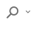
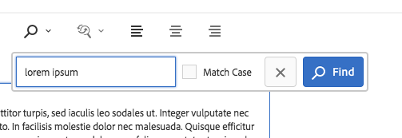
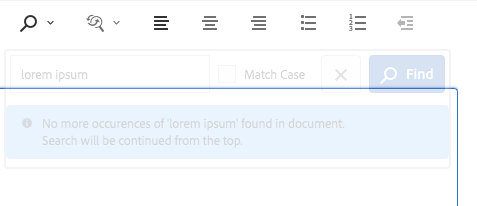
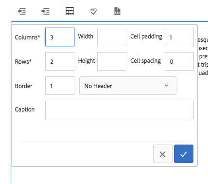
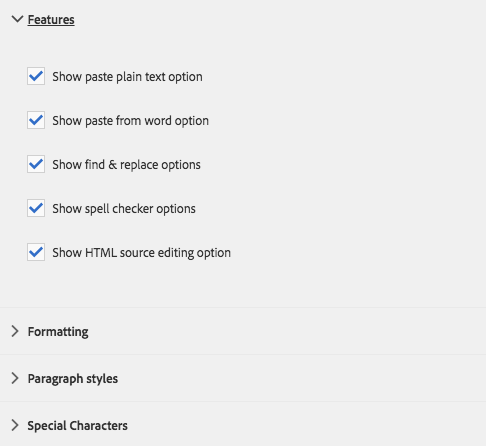

# Componente de texto{#text-component}

El componente de texto del componente principal es un componente de composición y edición de texto enriquecido que incluye edición in situ.

## Uso {#usage}

El componente de texto ofrece un potente editor de texto enriquecido que permite una edición de texto sencilla en un editor en línea simplificado y en un formato de pantalla completa.

El cuadro de diálogo [de](#edit-dialog) edición incluye edición en línea con opciones limitadas con funcionalidad completa disponible en el cuadro de diálogo de edición a pantalla completa. Mediante el cuadro de diálogo [de](#design-dialog)diseño, se pueden configurar opciones de formato de texto como encabezados, caracteres especiales y estilos de párrafo para la plantilla del autor del contenido.

## Versión y compatibilidad {#version-and-compatibility}

La versión actual del componente de texto es v2, que se introdujo con la versión 2.0.0 de los componentes principales en enero de 2018, y se describe en este documento.

En la tabla siguiente se detallan todas las versiones compatibles del componente, las versiones de AEM con las que las versiones del componente son compatibles y los vínculos a la documentación de versiones anteriores.

| Versión del componente | AEM 6.3 | AEM 6.4 | AEM 6.5 |
|---|---|---|---|
| v2 | Compatible | Compatible | Compatible |
| [v1](text-v1.md) | Compatible | Compatible | Compatible |

Para obtener más información sobre las versiones y versiones de los componentes principales, consulte el documento Versiones [de componentes](versions.md)principales.

## Ejemplo de salida de componente {#sample-component-output}

Para experimentar el componente de texto y ver ejemplos de sus opciones de configuración, así como la salida HTML y JSON, visite la biblioteca [de](http://opensource.adobe.com/aem-core-wcm-components/library/text.html)componentes.

### Detalles técnicos {#technical-details}

La documentación técnica más reciente sobre el componente de texto [puede encontrarse en GitHub](https://github.com/adobe/aem-core-wcm-components/blob/master/content/src/content/jcr_root/apps/core/wcm/components/text/v2/text).

Encontrará más detalles sobre el desarrollo de los componentes principales en la documentación [para desarrolladores de los componentes](developing.md)principales.

## El componente de texto y el editor de texto enriquecido {#the-text-component-and-the-rich-text-editor}

El componente de texto Componentes principales aprovecha el Editor de texto enriquecido (RTE) de AEM. RTE proporciona a los autores de contenido una amplia gama de funciones para editar su contenido de texto. El RTE es muy flexible en su configuración y ofrece una serie de opciones. Encontrará más información sobre cómo se puede configurar RTE en los artículos [Configurar el editor](https://helpx.adobe.com/experience-manager/6-5/sites/administering/using/rich-text-editor.html) de texto enriquecido y [Configurar los complementos](https://helpx.adobe.com/experience-manager/6-5/sites/administering/using/configure-rich-text-editor-plug-ins.html)del editor de texto enriquecido.

El resto de este artículo muestra la configuración estándar del componente de texto de componentes principales con la configuración RTE lista para usar.

>[!NOTE]
>
>En el componente de texto solo están disponibles las opciones activadas por las configuraciones de [IU de RTE](https://chl-author-preview.corp.adobe.com/content/help/en/experience-manager/6-5/sites/administering/using/rich-text-editor.html) .

## Edit Dialog {#edit-dialog}

El cuadro de diálogo de edición ofrece las herramientas de formato de texto enriquecido estándar que un usuario espera que compongan texto.

### Negrita

Se utiliza para aplicar formato de negrita al texto seleccionado o para aplicar formato negrita al texto introducido después del cursor.

**Ctrl+B** se puede utilizar como método abreviado de teclado.

### Cursiva

Se utiliza para aplicar formato en cursiva al texto seleccionado o texto en cursiva introducido después del cursor.

**Ctrl+I** se puede utilizar como método abreviado de teclado.

### Subrayado

Se utiliza para aplicar formato subrayado al texto seleccionado o para subrayar el texto introducido después del cursor.

**Ctrl+U** se puede utilizar como método abreviado de teclado.

### Subíndice

Se utiliza para dar formato al texto seleccionado o al texto introducido después del cursor como subíndice.

### Superíndice

Se utiliza para dar formato al texto seleccionado o al texto introducido después del cursor como superíndice.

### Pegar como texto

Pega el texto copiado como texto sin formato sin ningún formato.

Al seleccionar esta opción, se abre una ventana donde el texto se puede pegar como texto sin formato sin formato como vista previa antes de insertarlo en el texto. Acepte tocando o haciendo clic en la marca de verificación, cancele la acción tocando o haciendo clic en la x.

### Pegar desde Word

Al seleccionar esta opción, se abre una ventana donde se puede pegar el texto manteniendo su formato como una vista previa antes de insertarlo en el texto. Acepte tocando o haciendo clic en la marca de verificación, cancele la acción tocando o haciendo clic en la x.

### Hipervínculo

Utilice esta opción para convertir el texto seleccionado en un hipervínculo o modificar un vínculo ya definido. Esta opción solo está activa cuando el texto ya está seleccionado y abre una ventana con opciones adicionales para configurar el vínculo.

* Introduzca la ubicación
   * Utilice el cuadro de diálogo Abrir selección para elegir una ruta en AEM
   * Si el vínculo no está dentro de AEM, introduzca la dirección URL absoluta (las rutas no absolutas se interpretan como relativas a AEM)
* Escriba un texto descriptivo alternativo para el vínculo
* Seleccionar comportamiento de vínculo
   * Destino
   * Misma ficha
   * Nueva ficha
   * Marco principal
   * Marco superior
   Toque o haga clic en la marca de verificación para aplicar el vínculo o la x para cancelar.

### Desvincular

Utilice esta opción para eliminar un vínculo ya aplicado al texto seleccionado. Esta opción solo está activa cuando ya se ha seleccionado un vínculo.

### Buscar

Utilice esta opción para buscar en el texto la aparición de una cadena de texto especificada. Al seleccionar esta opción se abre una ventana para especificar las opciones de búsqueda.

Escriba el texto para el cual desee buscar y toque o haga clic en **Buscar** para comenzar la búsqueda. Toque o haga clic en la x para cancelar.
Si desea hacer una coincidencia exacta según el caso, seleccione la opción **Coincidir mayúsculas y minúsculas** antes de iniciar la búsqueda.
Si se encuentra una coincidencia, ésta se resalta y el cuadro de diálogo de búsqueda se atenúa. Toque o haga clic de nuevo en el botón **Buscar** del cuadro de diálogo atenuado para buscar la siguiente incidencia.

Si no se encuentran más incidencias, se mostrará un mensaje y la búsqueda se reiniciará desde el principio del texto.

### Reemplazar

Utilice esta opción para buscar en el texto ocurrencias de una cadena de texto especificada y reemplazar las coincidencias por otra cadena. Al seleccionar esta opción se abre una ventana para especificar las opciones de búsqueda y reemplazo.

Escriba el texto para el que desea buscar, así como el texto con el que debe reemplazarse.

Toque o haga clic en **Buscar** para comenzar la búsqueda. Toque o haga clic en la x para cancelar.

Si desea hacer una coincidencia exacta según el caso, seleccione la opción **Coincidir mayúsculas y minúsculas** antes de iniciar la búsqueda.

Si se encuentra una coincidencia, ésta se resalta y el cuadro de diálogo de búsqueda se atenúa. Vuelva a hacer clic en el botón **Buscar** del cuadro de diálogo atenuado para buscar la siguiente incidencia o seleccione el botón **Reemplazar** para reemplazar el texto resaltado y coincidente. Tenga en cuenta que el botón **Reemplazar** solo está activo una vez que se ha realizado una coincidencia.

Seleccione **Reemplazar todo** para reemplazar todas las apariciones del texto a la vez.

### Alinear texto a la izquierda

Se utiliza para alinear el texto con el margen izquierdo.

### Centrar texto

Se utiliza para centrar el texto.

### Alinear texto a la derecha

Se utiliza para alinear el texto con el margen derecho.

### Viñeta

Se utiliza para dar formato al texto seleccionado como una lista con viñetas o para comenzar la inserción de una lista con viñetas después del cursor.

Para finalizar una lista con viñetas, toque o haga clic de nuevo en el botón **Viñeta** o introduzca dos retornos de carro.

### Numerado

Se utiliza para dar formato al texto seleccionado como una lista numerada o para comenzar la inserción de una lista numerada después del cursor.

Para finalizar una lista numerada, toque o haga clic de nuevo en el botón **Numerado** o introduzca dos retornos de carro.

### Anular sangría

Se utiliza para reducir el nivel de sangría del texto seleccionado o del texto introducido después del cursor.

Solo activa si el texto o la posición seleccionados del cursor ya están sangrados.

### Sangría

Se utiliza para aumentar el nivel de sangría del texto seleccionado o del texto introducido después del cursor.

### Tabla

Se utiliza para insertar una tabla en el texto. Al seleccionar esta opción se abre una ventana para especificar los detalles de la tabla.

* **Columnas** El número de columnas de la tabla (obligatorio)
* **Filas** El número de filas de la tabla (requerido)
* **Anchura**
La anchura de la tabla
* **Altura**
La altura de la tabla
* **Relleno** de celdas El espacio alrededor del contenido de la celda
* **Espaciado** de celdas El espacio entre celdas
* **Borde** El peso de las líneas de borde de la tabla
* Si para el encabezado de la tabla:
   * Se debe utilizar la primera fila
   * Debe utilizarse la primera columna
   * Debe utilizarse la primera fila y la primera columna
   * O bien, no se debe utilizar ningún encabezado.
* **Rótulo** El rótulo de la tabla

### Revisar ortografía

Se utiliza para revisar la ortografía del contenido del texto. Los posibles errores ortográficos se ven subrayados con líneas rojas rotas rotas.

Encontrará más detalles sobre la revisión ortográfica y la personalización de los diccionarios de revisión ortográfica en el documento [Configurar los complementos](https://helpx.adobe.com/experience-manager/6-5/sites/administering/using/configure-rich-text-editor-plug-ins.html)del editor de texto enriquecido.

### Caracteres especiales {#special-characters}

Se utiliza para insertar caracteres especiales en el texto. Al seleccionar esta opción, se abre una ventana donde se muestran los caracteres disponibles.

Toque o haga clic en el carácter deseado para insertarlo en el texto después del cursor. Se pueden insertar varios caracteres. Toque o haga clic en la x para cerrar la ventana de selección.

### Modificar código fuente

Se utiliza para ver y modificar el origen HTML del texto.

Toque o haga clic en el icono Editar **** origen para cambiar el contenido del texto desde la vista con formato para ver el HTML sin procesar. En este modo, todas las demás opciones de formato están desactivadas. Toque o haga clic en el icono Editar **** origen de nuevo para volver a la vista con formato.

>[!CAUTION]
>
>Como siempre sucede con el acceso a HTML sin procesar, hay que tener cuidado al usar la opción Editar **** origen.
>
>El código HTML introducido mediante la edición **de** código fuente se analiza para detectar riesgos XSS y las secuencias de comandos insertadas se eliminan y no aparecerán en la página resultante. Sin embargo, el HTML mal formado introducido en la edición **de** origen puede dañar la plantilla de la página, lo que da como resultado un formato inesperado o que la página resultante quede inutilizable.

>[!NOTE]
>
>Dado que el HTML introducido mediante la edición **de** origen se analiza para detectar riesgos XSS y cualquier secuencia de comandos y elimina automáticamente los encontrados, el contenido real que se mantenga puede variar de lo que se introdujo en la edición **de** origen. Por este motivo, para guardar los cambios realizados con Edición **** de origen, primero debe salir de Editar **** origen para ver el texto en el editor normal antes de guardarlo.

### Formato de párrafo

Se utiliza para aplicar formato de párrafo al texto seleccionado o al texto insertado después del cursor. Al seleccionar estas opciones se abre una lista desplegable desde la que se selecciona el formato de párrafo.

El componente de texto también se puede editar en línea, pero debido a limitaciones de espacio, no todas las opciones de formato están disponibles en línea. Para ver todas las opciones, cambie al modo de pantalla completa.

## Cuadro de diálogo Diseño {#design-dialog}

El cuadro de diálogo de diseño permite al autor de la plantilla definir qué opciones de formato de texto están disponibles para los autores de contenido.

### Ficha Complementos {#plugins-tab}

La ficha Complementos se utiliza para habilitar y deshabilitar varias opciones de formato de texto disponibles para los autores de contenido.

### Características {#features}

Las siguientes funciones se pueden activar o desactivar para el componente.

* Pegar texto sin formato
* Pasado de la palabra
* Buscar y reemplazar
* Corrector ortográfico
* Edición de origen

### Formato {#formatting}

Las siguientes opciones de formato se pueden activar o desactivar para el componente.

* Tabla
* Listas
* Alineación
* Negrita, cursiva, subrayado
* Vínculos
* Subíndice/superíndice

### Estilos de párrafo {#paragraph-styles}

Los estilos de párrafo se pueden activar o desactivar para el componente. Cuando se activa, se pueden definir los formatos permitidos.

* Toque o haga clic en el botón **Agregar** para insertar un nuevo estilo.
* Introduzca el código del estilo y una descripción que se mostrará en el cuadro de diálogo de edición.
* Para eliminar un estilo, toque o haga clic en el botón **Eliminar** .
* Para reorganizar el orden de los formatos, toque o haga clic y arrastre los controladores.

### Configuración de caracteres especiales {#configuring-special-characters}

La opción para insertar caracteres especiales se puede activar o desactivar para el componente. Cuando se activa, se pueden definir los caracteres permitidos.

* Toque o haga clic en el botón **Agregar** para insertar un carácter nuevo.
* Introduzca el código HTML del carácter y una descripción que se mostrará en el cuadro de diálogo de edición.
* Para eliminar un carácter, toque o haga clic en el botón **Eliminar** .
* Para reorganizar el orden de los caracteres, toque o haga clic y arrastre los controladores.

## Ficha Estilos {#styles-tab}

El componente de texto admite el sistema [de](authoring.md#component-styling)estilo AEM.