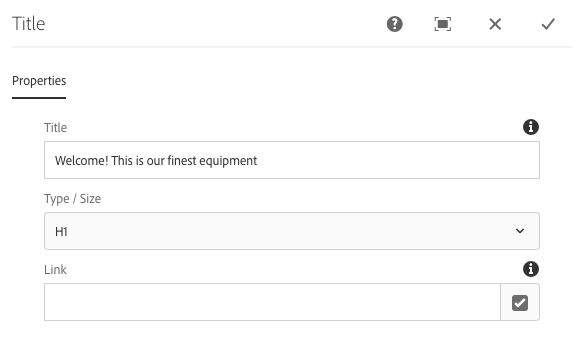

# Componente de título{#title-component}

El componente Título del componente principal es un componente de encabezado de sección que incluye la edición in-situ.

## Uso {#usage}

El componente Título está diseñado para utilizarse como título o encabezado de una sección de contenido. El autor de la plantilla puede definir los niveles de encabezado disponibles en el cuadro de diálogo [de](#design-dialog)diseño. El editor de contenido puede seleccionar los niveles de encabezados disponibles en el cuadro de diálogo [de](#edit-dialog)edición. Para mayor comodidad, también está disponible la edición in situ del texto del encabezado.

## Versión y compatibilidad {#version-and-compatibility}

La versión actual del componente Título es v2, que se introdujo con la versión 2.0.0 de los componentes principales en enero de 2018, y se describe en este documento.

En la tabla siguiente se detallan todas las versiones compatibles del componente, las versiones de AEM con las que las versiones del componente son compatibles y los vínculos a la documentación de versiones anteriores.

| Versión del componente | AEM 6.3 | AEM 6.4 | AEM 6.5 |
|---|---|---|---|
| v2 | Compatible | Compatible | Compatible |
| [v1](title-v1.md) | Compatible | Compatible | Compatible |

Para obtener más información sobre las versiones y versiones de los componentes principales, consulte el documento Versiones [de componentes](versions.md)principales.

## Ejemplo de salida de componente {#sample-component-output}

Para experimentar el componente Título, así como ver ejemplos de sus opciones de configuración, así como la salida HTML y JSON, visite la biblioteca de componentes.

### Detalles técnicos {#technical-details}

La documentación técnica más reciente sobre el componente Título [puede encontrarse en GitHub](https://github.com/adobe/aem-core-wcm-components/blob/master/content/src/content/jcr_root/apps/core/wcm/components/title/v2/title).

Encontrará más detalles sobre el desarrollo de los componentes principales en la documentación [para desarrolladores de los componentes](developing.md)principales.

## Edit Dialog {#edit-dialog}

El cuadro de diálogo de edición permite al autor del contenido definir el texto del título y seleccionar el nivel del encabezado.

* **Título** : si está vacío, se utilizará el título de la página
* **Tipo/Tamaño** : define el nivel de encabezado del título
* **Vínculo** : define el contenido al que se vinculará el título. Puede ser una ruta a una página de contenido, una dirección URL externa o un anclaje de página.

>[!CAUTION]
>
>La capacidad de definir un vínculo para el título se introdujo con la versión 2.2.0 de los componentes principales.

El editor in-situ también puede utilizarse para editar el texto del componente de título.

## Cuadro de diálogo Diseño {#design-dialog}

El cuadro de diálogo de diseño permite al autor de la plantilla definir el nivel de encabezado predeterminado que tendrán los componentes de título cuando los creen los autores de contenido.

### Ficha Tamaños {#sizes-tab}

* **Tipos permitidos / Tamaños para autores** : habilite o deshabilite los tipos de encabezados que estarán disponibles para los autores de contenido cuando usen el componente Título.
* **Tipo/Tamaño** predeterminado: defina el tipo de encabezado que se asignará automáticamente cuando un autor de contenido agregue el componente Título a una página.
* **Deshabilitar vínculo**: deshabilite la compatibilidad con vínculos en el componente de título para impedir que los autores de contenido se vinculen desde títulos.

>[!CAUTION]
>
>La capacidad de definir un vínculo para el título se introdujo con la versión 2.2.0 de los componentes principales.

### Ficha Estilos {#styles-tab}

El componente Título admite el sistema [de](authoring.md#component-styling)estilo AEM.